:experimental:

= Selecting the Static Site Generator – New Docsvision Documentation pt.1

Hello everyone! My name is Vladimir Markiev, I'm a technical writer in Docsvision - a company that creates it's own electronic document management system.

i want to share a story about how we came to the new documentation and why we decided to. At first, I will give an overview of our old documentation and then i will tell how we came to the new documentation

This part of the article describes the choice of a suitable static site generator and what a SSG actually is. The second part will describe the transition process in more detail.

== How old documentation is set up

Our product has modular architecture and there is a separate manual for each module. Sometimes there are three separate manuals: user, administrator and programmer. There is also a number of small documents like changelog, list of fixed errors, update guide and some others.

=== Large manuals:

* From &lt;200 to 300 pages and beyond;
* Written in DITA;
* Exported to .pdf and .html with use of DITA OT. We have our own XSLT transformations set up.

=== Small manuals:

* ~10 pages;
* Written in Markdown;
* Usually exported only to .pdf with use of the same DITA OT and XSLT transformations.

If you fot mixed up, let me give you an example. Base module of our system is called Platform. For Platform there are three manuals: user, administrator, programmer. There is also many accompanying documents: changelog, list of fixed errors, update guide, etc.

.Platform documentation. They're all in Russian, but you can see the point
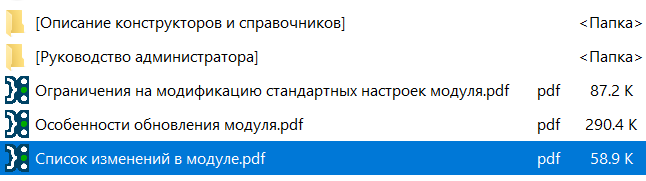

.Common documentation. At least 7 pdfs and two large manuals.
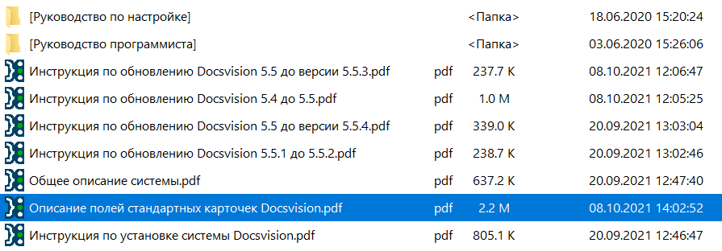

There's a little less documentation for an additional module of our system - Web Client

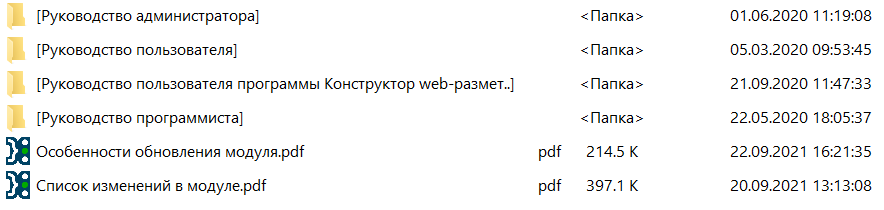

And there is even less documentation for other additional module -- WorkerService:

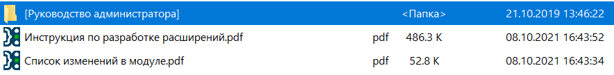

The source has some files, but nothing extraordinary: source files in DITA and build.config - a configuration file for self-written CL program that automatically launches DITA OT with all required parameters.

.Markdown:
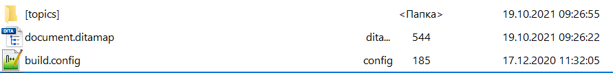

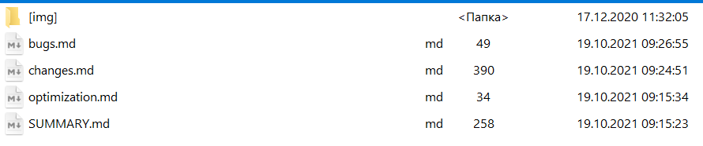

.DITA:
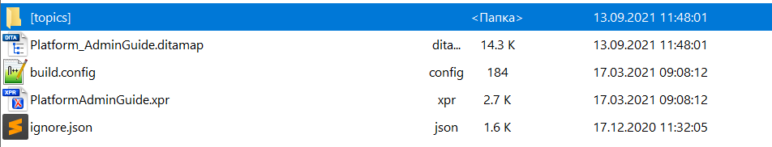
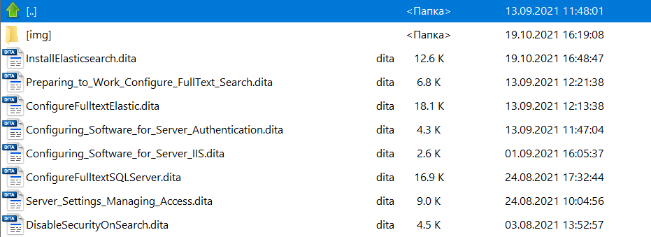

== What we don't like about old documentation?


We realized that our current documentation is not good for us, and it's time to move on. Why?

* First of, it's offline.
** Yes, we generate html, that we upload to our
https://docsvision.com/docs/webclient/5.5.16/UserGuide/index.html[web site], but this is not what we need, it's generated locally and uploaded manually, besides there is also pdf generated manually. Not ideal.
* Second, source formats vary. We have both DITA and Markdown.
** it would be nice to have only one source format.
* Third, there is no versioning.
** The repository has tags, branches, but output has no versions at all. Only manually created versions on our website.

Everyone (more samples below) has already moved their docs to online, even our main competitors, but we still put out our pdf and static html to the website folder. Action was required and urgently.

So I started a research of the market and drafted out the requirements of what we want to see in our docs.

== Requirements

Draft list of requirements for new docs:

. One source format.

. Obvious designation of version.

. Last change date.

. Page of documents in development.

. Breadcrumbs.

. Reuse of docs code.

. Syntax highlight.

. Preview before publishing.

. Main toc and page toc.

. Docs search is mandatory. https://swiftype.com/[Swiftype],
 http://www.tipue.com/[Tipue], https://docsearch.algolia.com/[Agoolia Docs
 Search] (they say that it's easy to deploy), https://support.google.com/customsearch/answer/4513751?hl=en&ref_topic=4513742&rd=1[Google
 Search]
 (Google search might be pretty convenient and cool).

. To have Diagrams would be great.

. Validation before publishing. Check for missing images and broken links.

_Spoiler: not all requirements were implementd in the result, but we're satisfied with the result._

We decided that we don't want to go full house and make transition in stages. Docs for the next released module will be in the new format. The next release of some of the other module after that will be also in new format. it will be easier than converting all docs at once.

== Understanding the task

I was just visiting random docs sites and understood that what we need is called a static site generator.

SSG - Static Site Generator allows to create (who would've thought) a static web site. Docs source code is written dynamically, but the site is static i.e. WSIWYG, one page –
one source document. It's like html export from DITA, but better. Better because we don't need additional steps: manual upload of html and it satisfies all the reqirements we set for the docs site.

SSG consist of:

* *Environment or platform* - programming language that the SSG is written on. It affects the configuration, customization and generator operation. You know, if you had an experience in programming with this language you will be almost familiar with the SSG and will take more use out of it. Let me tell you that there are https://gist.github.com/briandominick/e5754cc8438dd9503d936ef65fffbb2d[a lot of] different SSG options.

* *Web template system* - It's important to choose an SSg with a system that will allow code reuse that will save you time. Basically i's the SSG's engine, some examples include: Liquid, Haml, Slim, Twig. The engine is usually built-in in the SSG.

*How SSGs work*: We take source docs in some format, edit them, put them in the repository. Between editing and the repository some SSGs allow preview, broken links validation and some other pleasant perks. Then Git assembles the site from source code in our format while converting it to HTML and publishes it at specified URL.

There are also things that assemble and deploy sites made in the generator. For example, https://www.netlify.com/[Netlify] -- one of the most popular services.

_There is a nice dissection of SSGs_ https://about.gitlab.com/blog/2016/06/10/ssg-overview-gitlab-pages-part-2/[from
GitLab]

Next I will give some examples of SSG-generated sites.

== Static site examples that would satisfy our requirements

=== DITA OT

https://www.dita-ot.org/colophon[The site] is written in  Markdown and HTML, deployed using https://www.netlify.com/[Netlify]. Source code is available in https://github.com/dita-ot/website[GitHub repo].

____
&lt;..&gt; enriched with Liquid templating tags and styled with Sass. The Bootstrap framework provides the foundation for the site layout. The Jekyll publishing engine combines these plain text components to the final static website you see here.
____

* Convenient that it has version in development and almost anyone can edit it directly from browser.
* Inconvenient that is has both MD and HTML.
* Convenient that there is a deployment manual, which can be used as a template.
* Inconvenient that there is too many variables: Jekyll, Liquid, Bootstrap.

Reuse is organized with Liquid and Jekyll as I think. There's no last
modified, but there is versioning.

_Ironic is that DITA Open Toolkit site is written in Markdown._

=== YouTrack

https://www.jetbrains.com/help/youtrack/standalone/2021.4/YouTrack-Documentation.html[YouTrack] docs. What it's written in is a mystery to me, same as reuse.

It has last modified, but not who modified it. Well, not that it matters much. It has versioning, but you cant switch from a newer version to an older one. it's either intended or it's a bug.

I found https://plugins.jetbrains.com/docs/intellij/welcome.html[IntelliJ Platform SDK] docs, https://github.com/JetBrains/intellij-sdk-docs[Source code repo]. It's the same principal as YouTrack docs, but I couldn't find what they used to deploy it.

=== GitLab

https://docs.gitlab.com/[GitLab] docs. Source code https://gitlab.com/gitlab-org/gitlab-docs[repo]. Written in Markdown, https://nanoc.app/doc/tutorial/[Nanoc], generates the site and http://rouge.jneen.net/[Rouge], highlights sytax. There is a great https://about.gitlab.com/blog/2016/12/07/building-a-new-gitlab-docs-site-with-nanoc-gitlab-ci-and-gitlab-pages/[article] where the process of deployment is written in great detail. One can study the article and try to reverse engineer it to get the same site.

Ruby in Docker image helps to publish the site. Testing after merges is done with https://about.gitlab.com/stages-devops-lifecycle/review-apps/[ReviewApps] -- this is GitLab's own development.

There are some things I couldn't understand, some steps I could understand, but overall it's a pretty complicated instruction. There's a lot of tasks in yaml and a lot of small nuances you have to keep in mind .

There is versioning and anything your heart can desire. Except for last modified, but it shouldn't be too hard to understand in case you want to have it.

=== GitHub Docs

https://docs.github.com/en/authentication/connecting-to-github-with-ssh/adding-a-new-ssh-key-to-your-github-account[This] is the site, https://github.com/github/docs/blob/main/content/authentication/connecting-to-github-with-ssh/adding-a-new-ssh-key-to-your-github-account.md[this] is the source code repo.

It has versioning in the right corner for the whole site. No last modified and very little info as for how it built. Only start page of Nanoc boasts that GitHub Docs is built on it.

.Nanoc start page
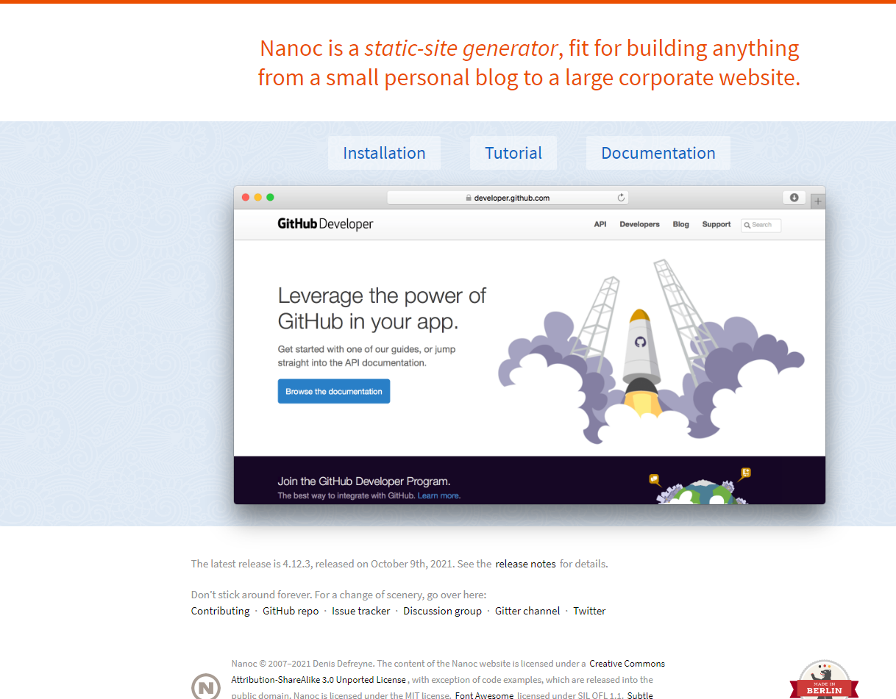

_GitHub Developer redirects to docs.github.com, so it's the same thing, while Nanoc obviously has an outdated screenshot._

=== Bootstrap

https://getbootstrap.com/docs/5.1/getting-started/introduction/[Bootstrap docs] build on Hugo, written in Markdown. Source code repo on https://github.com/twbs/bootstrap/tree/main/site/content/docs[GitHub].
This is probably the most convenient site of all. Versioning -- check, page toc -- check, breadcrumbs -- not check, though.

Interesting thing is that neither main menu nor page toc are hidden, they are fixed on the page. I would expect more effects and styling from Bootstrap. I guess the simpler, the better.

The site uses https://docsearch.algolia.com/[Agoolia Docs Search]. Deployment instructions for the docs can be found https://github.com/twbs/bootstrap#running-documentation-locally[here].

=== Prometheus.io

No idea what https://prometheus.io/docs/introduction/overview/[Prometheus.io] is, just added it as one more example. The site is made with Nanoc, uses Ruby for deployment. All source code is in https://github.com/prometheus/docs[GitHub] repo. You can find deployment instructions there too. The site is written in Markdown.

It has page toc, but no last modified. Versioning is built-in in the site menu (https://prometheus.io/docs/prometheus/latest/getting_started/["when there is versioning"]). You can use the template from their GitHub.

=== Jekyll

Jekyll is one of the most wide-spread SSG for Markdown, it is reasonable to assume that its' site and especially its' https://jekyllrb.com/docs/[docs] are built with Jekyll and deployed using GitHub. The site has search, versioning, toc is on the right side for a change. There is a https://github.com/jekyll/jekyll/tree/master/docs#running-locally[small guide] for local deployment, but not too detailed. In addition, there is a guide on  https://jekyllrb.com/[Jekyll website], if you like it better. Made with Ruby.

=== Antora docs

https://docs.antora.org/[Very cozy docs site]. You can just clone the https://gitlab.com/antora/antora[repo] and try to build from it. Or you can use Antora from https://gitlab.com/antora/docker-antora[Docker].

=== Asciidoc Docs

https://github.com/asciidoctor/asciidoc-docs[This] is the source code repo, https://docs.asciidoctor.org/asciidoc/latest/syntax-quick-reference/[this] is the site. The guide for assembling the docs is in Antora docs. So you can just clone it and build the site just by replacing the source files with your own. uses Netlify for deployment.

== SSGs also can

. https://firebase.google.com/docs/web/setup/[Use] user authentication. How can it be useful for a docs site, no idea. Probably just for fun.
. Sitemap and SEO, so the site could be found from the search engines and users could get involved in your product docs. Most likely.
. https://teletext.io/[Teletext.io] -- edit content directly from the browser. My thought is that repositories are better suited for that purpose.
. Contact forms https://formspree.io/[Formspree], https://formkeep.com/[FormKeep], http://www.wufoo.com/[Wufoo], http://www.foxyform.com/[FoxyForm], https://www.google.com/forms/about/[Google Forms].
. Disqus comments.

== Options on the table

So I studied the market, next step is selecting the solution that will be the best for us.

=== Solution #1 -- HTML/DITA

One more time -- right now most of our docs are in DITA. Outputs: PDF and HTML. If we keep uploading HTMLs to our Git repo, set up Git Pages, we will get a complete site with minimal input.

*Pros*: Minimal time consumed, almost no need to change docs format, we can even keep the UI since it is already set up. From Markdown we can create the same HTML using DITA-OT.

*Cons*: if we decide to alter something, we'll have to change DITA OT and XSLT. I have very little knowledge about DITA OT and XSLT since I've inherited it from my colleague. Well, I can always ask, how I did this, but am technical writer of not. I must be able to do it all myself. Besides, in this case source code and output will be detached. We'll have to figure out ways to make the build and publishing automatic. We'll also have to figure out versioning. A lot of additional steps that are not helpful at all.

==== Example of site built with DITA

We can try to build our site with DITA using commercial software. After some searching and found https://heretto.com/[Heretto] -- DITA dedicated SSG. When I was searching for solutions it was still https://docs.easydita.com/docs/user-guide/194/publish/static-site-generator-ssg[easyDITA] with not so much information. After the rebranding they kind of started doing better marketing. Now they eben have a https://www.youtube.com/watch?v=W37LFsB3bv4&ab_channel=Heretto[YouTube video manuals]. This is still not very intuitive and very cumbersome solution which is also commercial. I think, we'll pass.

The only site built with DITA I found is https://learningdita.com/[LearningDita]. Source code https://github.com/ScriptoriumDev/LearningDITA[repo] on GitHub. Source code in DITA, site works on WordPress, they use XSLT transformations for publishing.

The site has no versioning, no last modified. Very cumbersome solution and not convenient at all.

=== Solution #2 -- Jira

Docs on Confluence satisfy all our requirements: last modified, versioning and reuse can be arranged if needed.

* https://www.k15t.com/rock-the-docs/versioning[Versioning]
* https://www.k15t.com/rock-the-docs/content-reuse[Reuse]
* https://www.k15t.com/rock-the-docs/publishing/publish-your-content-as-a-help-center-with-scroll-viewport[Publishing]

Another commercial closed source solution, it'd be better to have open source.

=== Solution #3 -- Markdown

Some of our docs are already in MD. Why don't we convert all the docs to this format?

Converting DITA to MD can be done using standard DITA OT transformations.

Without any settings we get the following:

* Admonitions: Note, important etc. are not converted at all. After the transformation there is "Note" written in bold instead of an admonition.
* Almost all formatting is removed: monospace, italic etc. removed completely.
* But the images are saved. Yay!

.Conversion sample:
image:pics/DITAtoMD.png[Comparison]

We can improve XSLT transformations to have pretty MD in the result. But it will require additional time and work. And don't forget that we'll have to improve MD from the SSG to have reuse, cross-references etc. And MD is just too simple for any serious docs. Using MD is like inventing a perpetual motion machine from a cat and a toast.


.Perpetual motion machine
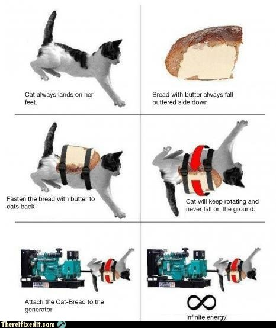

But I still wasn't satisfied, I had to compare all pros and cons.

*FOR MD:*

* Some manuals are already in MD.
* Very simple syntax.
* Supported by GitHub.
* We can use DITA OT transformation and convert everything at once.

*AGAINST MD:*

* Too many flavors.
* Very simple syntax. A lot of (cross-references, for example) will have to be invented using the SSG or something else.
* We don't have too many manuals in MD (I would estimate at 10-20%, but I can be wrong).
* To achieve any decent result we'll have to set up XSLT transformation. It's hard, and I don't know how to do it.
* Prospective to maintain all docs in MD doesn't look shiny at all.
+
 I doubt it will be easy to learn all the bells, whistles and engines no matter whatever format we choose. But it still doesn't change that writing docs in MD is too simple (and boring). Excuse me for saying that docs for our system are too complex for Markdown.
+
* Very often I'll have to switch keyboard layout to mark the beginning of a heading. After this complex action i often get mixed up with the current layout. Also the spaces. Too many spaces. It's hard to count spaces, harder than symbols.

== Next actions (simplified)

.Simplified algorithm of transition to new docs will look like this:
. Select new docs format.
. Find SSG for the new format.
. See if it allows reuse.
. Define the folder structure that is supported by SSG.
. Find guide or samples (even better) for deployment of a site with the SSG.
. Find editor for the selected SSG to make authoring more convenient.
. Convert the docs.
. Create the site according to the guide.

Usually, nothing is that simple, but we'll see.

== What other formats can be used to create a static site?

If converting is inevitable we might as well find a new format. Selecting a format is basically selecting an https://gist.github.com/briandominick/e5754cc8438dd9503d936ef65fffbb2d[SSG]. Each format is supported by its own SSG.

So there are different format languages, there is even a couple of Wiki formats.

._As a starting point I decided to look what formats are supported by GitHub. It will make choice easier:_
- https://daringfireball.net/projects/markdown/[.md] -- most simple and most obvious. Despite its simplicity many sites are written in it. So it can't be that bad, right? But what MD flavor shall we choose? https://commonmark.org/[CommonMark], https://kramdown.gettalong.org/[kramdown], https://daringfireball.net/projects/markdown/syntax[original Gruber Markdown], https://github.github.com/gfm/[Gitub flavored Markdown], https://fletcherpenney.net/multimarkdown/[Multimarkdown]?
- https://www.promptworks.com/textile/writing-paragraph-text[.textile] -- basically it's markdown that just happens to have more verbal syntax without spaces: `h2., bq., .p`.
- https://ruby.github.io/rdoc/[.rdoc] -- I honestly tried to understand it, but couldn't. Too complicated for creating docs if you ask me.
- https://orgmode.org/[.org] -- from a quick look it looks promising: checklists, todo lists, even macros and tags. But it will take a lot of time to get started with .org.
+
Great potential, a lot of abilities, but using only a small part of the whole potential makes me sad.
+
 _Site is translated into English, French and Japanese. Why these languages? Interesting choice._
+
- http://wikicreole.org/[.creole] - weir thing, development stopped in 2008. One of the creators got offended and broke up with the rest of the team. The best part that the whole drama is documented on the pages of the http://wikicreole.org/wiki/RadomirDopieralski[wiki istelf]. Why GitHub still supports it is a mystery to me.
- https://www.mediawiki.org/wiki/Help:Formatting[.mediawiki] -- looks curious if you want to create your own wiki. The design looks modern, the deployment guide isavailable, overall a pleasant wiki. Source code is https://phabricator.wikimedia.org/source/mediawiki/[open], there's a https://www.mediawiki.org/wiki/Manual:Contents[gdeployment guide]. But wiki is not exactly the format we see our docs in. But it will be very convenient to add new translations if we ever find ourselves in a situation where docs need translation in the future.
- https://docutils.sourceforge.io/docs/user/rst/quickref.html[.rst] -- a powerful tool. I remember it from the pirate releases on torrents from the past days. To use it as intended and create a site from it using for example https://www.sphinx-doc.org/en/master/[Sphinx] will be tough.
- https://metacpan.org/pod/perlpod[.pod] -- a little too complicated. There are simple things like headings and extremely complex things like tags and strange formulas. One does not simply write in .pod. And there's some kind of commercial banner in the footer of the site that hurts the reoputation of the site in my eyes.
- https://docs.asciidoctor.org/asciidoc/latest/syntax-quick-reference/[.asciidoc, .adoc, .asc] -- almost as simple as Markdown, but has a definitive syntax specification, wide range of output formats (just in case) and more powerfull out of the box. For starters it has attributes, IDs, xrefs and other perks. Always being improved and has a very active community.

So I decided to stop on AsciiDoc.

== Hooray, I made my choice!

* A lot of what DITA can do using XSLT (and MD totally can't) works out of the box in AsciiDoc and can be achieved with just one line of code. Additions like "Image X", section numbers, cross-references, attributes (DITA keys), level offset can be achieved with one line of code.
* I found IntelliJ Idea (free OpenSource Commuity Edition) - IDE from JetBrains with AsciiDoc plugin makes working with AsciiDoc even easier than working with MD. IntelliJ simplifies work with AsciiDoc while not interfering with the document structure (unlike oXygen XML author for instance). Just pure AsciiDoc, perfect support and direct communication with open-minded developers.
* IntelliJ Idea also has better spelling check than Typora, Sublime Text, Notepad++, and Oxygen combined.
* It also has better preview compared to Typora or Sublime Text.
* AsciiDoc is also supported by GitHub and converted into human-readable preview from the code.
* There is only one official AsciiDoc syntax.

After I've made up my mind about the source code format I kind of destined myself to work with Antora SSG. Antora is the dedicated and official AsciiDoc SSG. Static sites generated with can be found above: https://docs.antora.org/[Antora], https://docs.asciidoctor.org/home/[AsciiDoctor] and https://antora.zulipchat.com/#narrow/stream/282403-announce-.F0.9F.93.A2/topic/docs.20sites[many other]. There are https://gist.github.com/briandominick/e5754cc8438dd9503d936ef65fffbb2d[other] SSGs that support Antora as I learned late, but no other can be better than the one that was made by the creators of AsciiDoc. Antora can work with many repositories at once, has ability to reuse docs code and has support built-in in IntelliJ Idea.

=== Converting with Pandoc

There is still a question of converting from DITA. I found https://pandoc.org/[Pandoc] which will assist me in this enterprise. It won't work with DITA directly, but it will work with HTML, and we can create HTML from DITA. While it looks stupid: converting to HTML from DITA to covert it to AsciiDoc to create a static website, it definitely worth the trouble in my terms.

.Pandoc
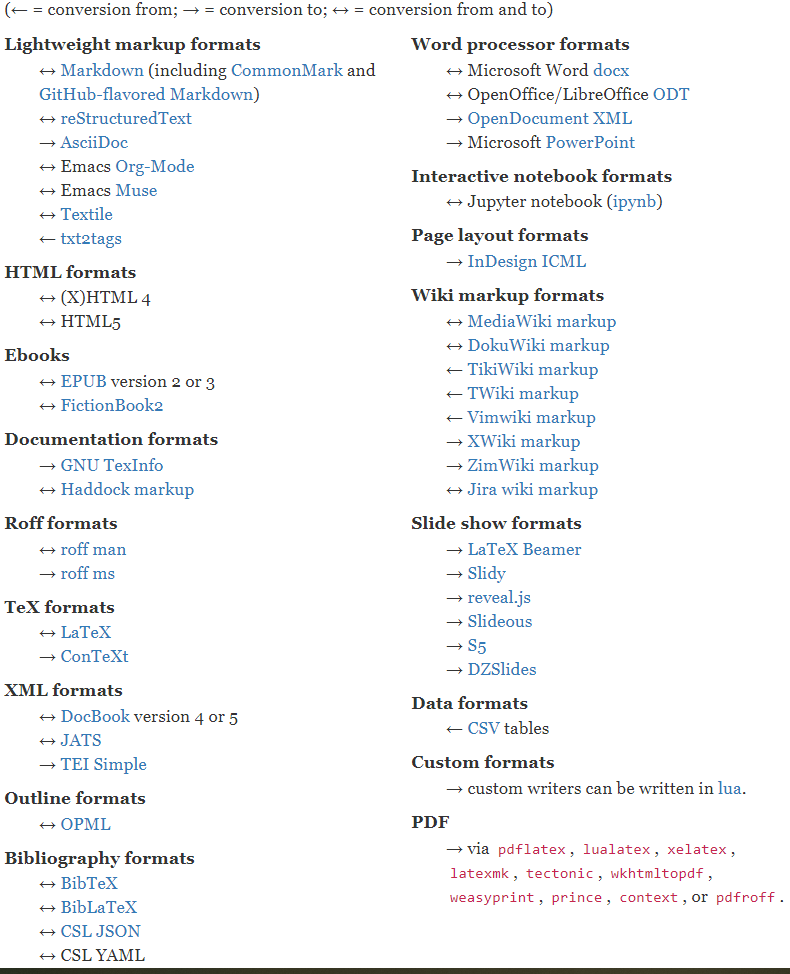

When converting with Pandoc in Windows environment there can be character set issues (rendered document can become unreadable). To avoid this issue the standard command needs to be altered from this:
`pandoc -f html -t asciidoc .\index.html &gt; ..\output\test.adoc` to this: `pandoc -f html .\index.html  -o ..\output\test.adoc`.

==== Package converting

To convert files in packages instead of single files I used .bat cmd file with the following contents:

[source,console]
----
@ECHO OFF
SETLOCAL
SET "sourcedir=.\"
PUSHD "%sourcedir%"
FOR /f "delims=" %%a IN (
 'dir /b /s /a-d *.md *.html '
 ) DO (
 IF /i "%%~xa"==".md" (
  IF NOT EXIST "%%~dpna.html" pandoc "%%a" -f markdown -t asciidoc -o "%%~dpna.adoc"
 ) ELSE (
  IF NOT EXIST "%%~dpna.MD" pandoc "%%a" -f html -t asciidoc -o "%%~dpna.adoc"
 )
)
popd
GOTO :EOF
----

IMPORTANT: I did conversion from plain HTML using standard  HTML transformation. This renders a cleaner output compared to converting with use of our custom XSLT template.

=== Conversion drawbacks

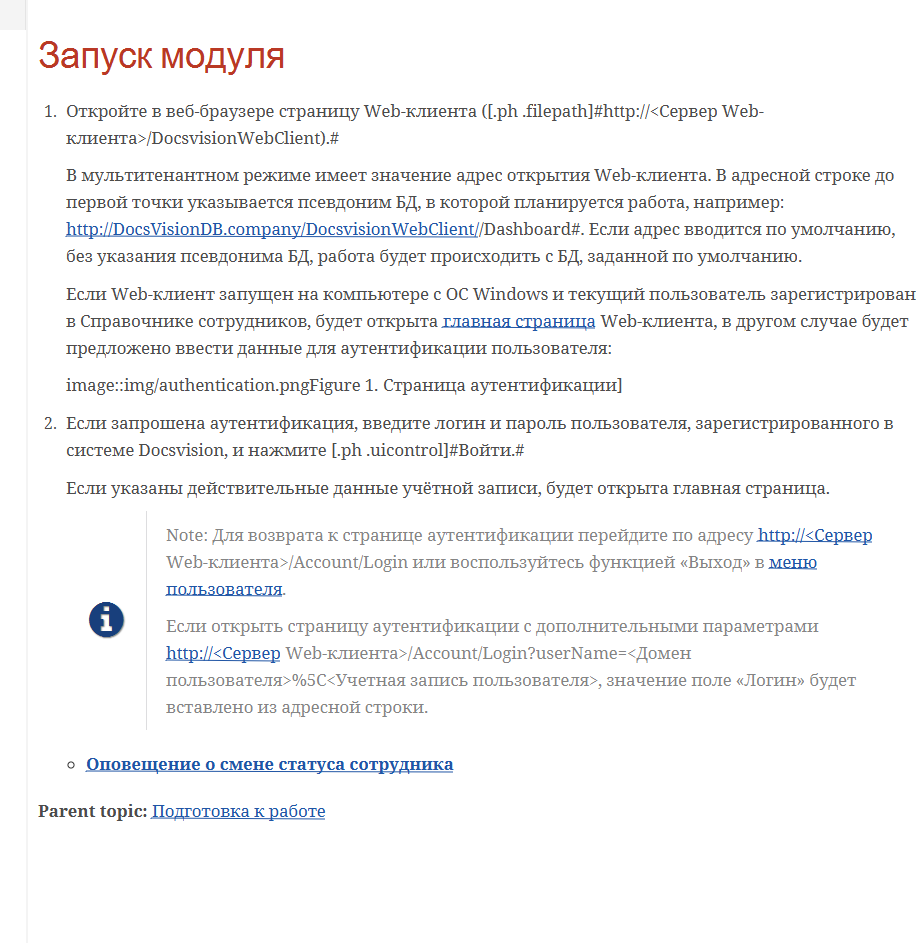

Double conversion leaves artifacts behind:

. The links are not changed automatically.
For instance: `topic.html` will not be automatically converted to `topic.adoc`. Not a huge problem, but I can't easily replace all `.html` with `.adoc` since there's still some links to internet pages in the docs. _Spoiler: I still replaced all `.html` with `.adoc` because I can and I will be reading and editing the docs after conversion. It's a great chance to re-read all the docs and correct some text here and there, etc._
. Toc has some errors too (`link::topics/topic.adoc` instead of `xref::topic.adoc`). But this is not a big deal, simple replace will do the trick.
. DITA tags titles are carried over to HTML and added to each element as a separate class. Something like `&lt;span class=&quot;term&quot;&gt;Act&lt;/span&gt;`. A little irritating, but Antora supports custom roles. The only problem is that there is a lot of unnecessary `#` symbols, crazy amount of them.
+
For example: `&lt;span class=&quot;term&quot;&gt;Act&lt;/span&gt;` should be italic. Italic font in AsciiDoc is declared with underlines: `_`. But after conversion it looks like this: `[.dfn .term]#Акт#`, and if it's the end of the paragraph it will be even worse: `[.dfn .term]#Act#.##`.
. Images are sometimes displayed incorrectly due to their location in DITA infrastructure, but again, it's not that big of a problem.

Next I will give scripts that will help to eradicate some conversion artefacts. The scripts were found in open sources and improved by me, community and my colleagues.

==== Delete IDs

The script will delete all unnecessary `[[ariaid-title1]]` and will replace `link:topics/` with `xref:` and all `link:` with `xref:`.

[source,powershell]
----
Get-ChildItem -Path *.adoc -file -recurse | ForEach-Object {

 $lines = Get-Content -Path $PSItem.FullName -Encoding UTF8 -Raw

 $patterns = @{
  '(\[\[ariaid-title1\]\])' = '' ;
  '(img/)' = '' ;
  '(link:topics/)' = 'xref:';
  '(link:)' = 'xref:';
  
 }
 $option = [System.Text.RegularExpressions.RegexOptions]::Singleline

 foreach($k in $patterns.Keys){
   $pat = [regex]::new($k, $option)
   $lines = $pat.Replace($lines, $patterns.$k)
 }

[IO.File]::WriteAllText($PSItem.FullName, $lines)

 }
----

==== Simple replacements

Next Powershell script wil replace all `[.dfn .term]#Act#` with `[.dfn .term]_Act_` and similar.

.The script is the following:
[source,powershell]
----
Get-ChildItem -Path *.adoc -file -recurse | ForEach-Object {

$lines = Get-Content -Path $PSItem.FullName -Encoding UTF8 -Raw

$patterns = @{
 '(\[\.dfn \.term])#(.*?)#' = '$1_$2_' ;
 '(\[\.keyword])#(.*?)#' = '$1*$2*' ;
 '(\[\.ph \.filepath])#(.*?)#' = '$1`$2`' ;
 '(\[\.ph \.uicontrol])#(.*?)#' = '$1*$2*' ;
 '(\[\.keyword \.parmname])#(.*?)#' = '$1_$2_' ;
 '(\[\.keyword \.wintitle])#(.*?)#' = '$1*$2*' ;
 '(\[\.kbd \.ph \.userinput])#(.*?)#' = '$1`$2`' ;

}
$option = [System.Text.RegularExpressions.RegexOptions]::Singleline 

foreach($k in $patterns.Keys){
  $pat = [regex]::new($k, $option)
  $lines = $pat.Replace($lines, $patterns.$k)
}

[IO.File]::WriteAllText($PSItem.FullName, $lines)
}
----

*_Here are some more complicated elements that will need attention later:_*

After the script ran, there will be trouble with more complex elements.

. `[.ph .menucascade]#[.ph .uicontrol]#Document# &gt; [.ph .uicontrol]#More Document# &gt; [.ph .uicontrol]#Act##`

Perfect option is to replace it like that: `menu:Документ[Документ УД &gt; Акт]`.

==== Underlined text

From HTML to AsciiDoc underlined text is converted as this `+++по дате создания+++`. While it should be like this: `[.underline]#по дате создания#`. However, it it better to replace underlined with something else since highlighting with underlined text is surprisingly outdated. Who knew!

==== Our company specifics

[source,asciidoc]
----
`[.ph .filepath]#http://DocsVisionDB.company/DocsvisionWebClient/#/Dashboard#`
----

`#/Dashboard` breaks the script. The line will look like this:

[source,asciidoc]
----
[source,[.ph .filepath]`http://DocsVisionDB.company/DocsvisionWebClient/`/Dashboard#```]
----

And AsciiDoc doesn't' want to recognise the `#` in the url `DocsvisionWebClient/#/Dashboard`. In such cases `#` should be replaced by `#&#35;` or escaping will be necessary like this: `/\#/` or this `\http://DocsVisionDB.company/DocsvisionWebClient/#/Dashboard`.

==== Other improvements

- `[.ph]`-- it's better to remove it
+
.Doesn't interfere when looks like this:
[source,asciidoc]
----
[.ph]#при копировании или вырезании другого# раздела.
----
+
.But really annoys me when looks like this:
[source,asciidoc]
----
[.ph .cmd]#Измените поля
 [.ph]#[#RenameSectionNomenclature__d8e33 .kbd .ph .userinput]#Индекс
 раздела#,
----
+
These are rare occurrences, but important nevertheless.  Since even after final editing there are errors:
+
.Before editing
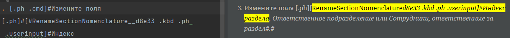
+
.After editing

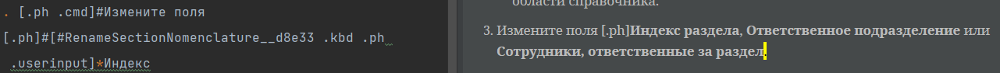
+
The thing is that the script will not find such `.userinput`, it will be necessary to edit it manually. Regexing this will be complicated since the first part `[#RenameSectionNomenclature__d8e33` depends on the name of the file. `__d8e33` is also always unique value. It's easier just to check it manually.
+
- `[.ph .cmd]` -- this can stay, but it's better to delete it. Why? Because it's not necessary.
+
[source,asciidoc]
----
[.ph .cmd]#Если запрошена аутентификация, введите логин и пароль
 пользователя, зарегистрированного в системе Docsvision, и нажмите
 [.ph .uicontrol]#Войти#.#
----
+
But it can also . It will serve as a https://docs.asciidoctor.org/asciidoc/latest/text/custom-inline-styles/#custom-style-syntax[custom role] in AsciiDoc. A special CSS can be applied to this role, which can be convenient is there's already a stylesheet for DITA which will keep the UI very similar to the one used after DITA transformation.

==== Images

**Straight to the solution:** Using a script in the following cases makes no sense to me. Corrections have to be done either manually or go the extra mile and https://pandoc.org/using-the-pandoc-api.html#[use] https://hackage.haskell.org/package/pandoc[API Pandoc]. Or just use IntrelliJ regex search using kbd:[CTRL+SHIFT+R].

Conversion will give this inline line image macro:

[source,asciidoc]
----
> image::img/dcard_delete_button.png[[.fig--title-label]##Рис. 1. ##Кнопка
> удаления карточки]
----

.Well, I mean it has to be inline, but it comes out as a block
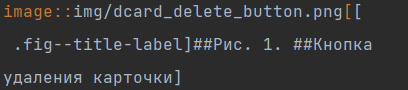

After the word "Кнопка" there is a new line and that's the reason why the image won't be displayed correctly. You can just remove this new line and the goal will be achieved -- the image will be displayed.

But it's better to beatify it. Beautification is turning each image macro into this block:

[source,asciidoc]
----
[#authentication]
.Страница аутентификации
image::img/authentication.png[Страница аутентификации]
----

.HTML source looks like this:
[source,html]
----
<div class="itemgroup info">
<figure class="fig fignone">
<figcaption>
<span class="fig--title-label">Figure 1. </span>
Страница аутентификации
</figcaption>
<br>

<br>
</figure>
</div>
----

.So, basically what you need is:
. Take file name without an extension, place it in brackets after the `#` symbol. This will be image block ID.
. Add line break.
. On a new line add a dot `.`, after the dot you need to enter the caption for the image that is located inside of `<figcaption>Страница аутентификации</figcaption>`.
+
While ignoring `<span class="fig--title-label">` completely.
+
This will be the image caption.
+
. Add line break.
. On a new line add a link to the image: `image::img/authentication.png ` and brackets.
. In brackets you will need to specify the caption that is licated inside `<figcaption> Страница аутентификации </figcaption>`.
 +
While ignoring `<span class="fig--title-label">` completely.
+
This will be the image ALT text.

Good luck trying to create an automatization process for this))

==== Admonitions

After conversion notes have headings or captions like these: `[.note__title]#Прим.:#`. These things need to be removed.

But if the caption looks like this `[.note__title]#Important:#`:

[source,asciidoc]
----
[NOTE]
====
[.note__title]#Important:#Notion
====
----

`[NOTE]` shall be replaced with `[IMPORTANT]` (upper case is mandatory). Caption `[.note__title]#Important:#` needs to be removed:

[source,asciidoc]
----
[IMPORTANT]
====
Notion
====
----

This caption can also be in other languages (if DITA author didn't care much about xml lang):

[source,asciidoc]
----
[NOTE]
====
 [.note__title]#Важное замечание:# Возможности форматирования комментариев и упоминания сотрудников доступны, только если включена экспериментальная функция «Контрол комментарии с html редактором».
====
----

It needs to be replaced with this:

[source,asciidoc]
----
IMPORTANT: Возможности форматирования комментариев и упоминания сотрудников доступны, только если включена экспериментальная функция «Контрол комментарии с html редактором».
----

But block macro is more reliable since admonitions can be multi line.

==== Menucascade

AsciiDoc has an experimental menu macro:

[source,asciidoc]
----
menu:Band[Opeb &gt; Close]
----

For it to work an attribute `:experimental:` needs to be defined.

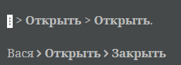

But conversion from DITA to HTML to AsciiDoc gives that:

[source,asciidoc]
----
[.ph .menucascade]#[.ph .uicontrol]*image:buttons/verticalDots.png[image]* &gt; [.ph .uicontrol]*Open*#.
----

You can take your time and replace all menucascade with the correct AsciiDoc analogue if you want. Since i wanted docs to look pretty, I did took some extra time to replace that.

However, there are some limitations.You can put an image in AsciiDoc  menu macro, but it's not advised by the creator of the AsciiDoc. If you have buttons in the DITA's menucascasde you can either describe buttons with text or find some other workaround.

image::pics/menu2.png[menuresult]

Workaround may look like this: `menu:\{zwsp}pass:m[image:dots.png[\][.ph .uicontrol]*Open* &gt; [.ph .uicontrol]*Close*\]`.

== Conclusion

This whole adventure started as a fun thing, but how many small nuances appeared along the way! But it's not the end yet, it's time to build the site with Antora. I wll tell you about this in the second part of the article. I will share, how I arranged files, how I set up the UI and what's more important, how I connected (elastic)search to Antora. I am happy with the choice I made. Antora and AsciiDoc together is like a good song that comes out very clean and good sounding.