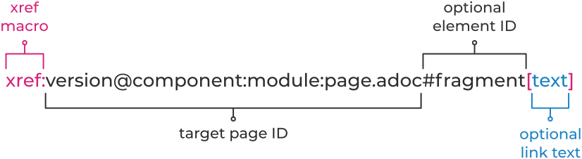

:icons: font

= New Docsvision docs pt. 2 –- Antora

I explained the troubles of choice in the first article. I described, how hard it was to select a SSG for creating new docs and how I had to double convert to AsciiDoc from HTML from DITA.

Here I explain how I started to work with SSG Antora, how I set up the UI and added a search for the site.

== Where does one start with Antora?

Well, from https://docs.antora.org/antora/2.3/#where-to-begin[Where to begin section] of Antora docs of course.

In this article I won't give in too much detail about organizing files in folders, what's the difference between playbook and component version descriptor, etc. -- these things are described in Antora docs clearly and extensively. I will only tell the basic steps that are required to understand the performed job:

. First step is installing Antora.
+
Check NODE LTS: `node --version`
+
Install Antora: `npm i -g @antora/cli @antora/site-generator-default`
+
. Then read the docs. It's better to read the docs from start to finish and not just Quick start guide to understand Antora better as a tool.
+
. The site address will look like this (image borrowed from Antora docs): image:https://docs.antora.org/antora/2.3/_images/module-page-url.svg[URL scheme]
+
*base url of site* -- for example, https://dv-docs.com;
+
*name of component* -- module, say, webclient;
+
*name of version* -- version of the module, for example, 16 or 17 -- specified in antora.yml;
+
*name of module* -- type of guide, for example, user, admin, layouts;
+
*name of page* - intro for instance.

== Structuring files

I read the https://docs.antora.org/antora/2.3/organize-content-files/[docs] and approximately imagined how the source files would be arranged.

DV modules = various Antora *components*.

DV module guides = various Antora *modules*.

Various Antora *components* are versioned and displayed in a separate menu.

Various Antora *modules* are only displayed in the site URL, they are not displayed anywhere in the navigation menu. I marked Antora modules on the screen from Antora docs site below.

.Modules
image:img/modules.png[Modules]

For us that means that user, admin, layouts designer guide will be patched into a single navigation menu.

From here we have two roads: create each guide as a separate component with a single module or put up with a single navigation menu and put separate guides into separate modules.

Obviously the second option is more logical, so I decided to stop on it.

First we will convert the Web-client docs to a new format. The next release version of Web-client will have number 17, meanwhile it's in development, the develop branch.

That's what was decided after investigation and consulting with the management.

.The source docs were arranged in the following manner:

I decided to put docs for separate DV modules in separate repositories and store versions in different branches.

_Develop_ branch will store future Web-client 17 docs.

_antora.yml_ is a file stored in the root of every branch.
For every new branch I create I will have to create its' unique _antora.yml_ file, which describes the version and its properties.

[IMPORTANT]
====
The path to antora.yml must not contain any foreign symbols except for latin letters, numbers and (en) dash. Spaces are not allowed same as hash (#) symbol не разрешаются, решётки. Otherwise, Antora will not run.
====

This is how _component versions_ are ensured, i.e. versioning.

The root of the repo must contain folder named *modules* (lower case is important).

Inside *modules* there can be as many folders as you like.
Each folder is a separate Antora module. In our case each Antora module is a separate guide: admin, user, layouts designer.

For each module there has to be its own navigation file. Navigation file represents a simple multi-level list. I'm too lazy to create a navigation from scratch for huge guides. Fortunately, after conversion there is an *index.adoc* for each guide, it suits almost perfectly for the role of navigation file.

.When I say almost perfectly I mean:
* Folder names and structure are different in Antora. I will have to delete `topics/` from the path to the file, but leave everything that goes after that.
* Links `link:` will have to be replaced by `xref:`.
* `html` extension will need to be replaced with `.adoc`.

Basically I will need to bring this: `\link:topics/topic.html[This is topic]` to `\xref:topic.adoc[]`. No big deal.

== Tailoring files to Antora

Along the way I found out that more refactoring will be required in order to bring the docs to the pretty view.

Through the whole text I will have to add cross-refrences to other modules and components in the following format:

.Image borrowed from Antora docs

Similar pages inside modules and components can be added to the navigation menu in a similar fashion: `xref:version@component:module:filename.adoc[]`. Though it is better to completely include the whole page like that: `include::version@component:module:filename.adoc`. Otherwise there will be cases when user looks at the "Web-client" docs, clicks a page in the navigation menu and suddenly finds himself in docs for the "Platform". The user will spend some time then to realise where he is and how to return.

One more important thing is page headings.
After the conversion all page headers are offset one level forward. The minimal level is L2, while Antora needs to have L1. So I will have to manually subtract one level from each heading. Well, there is a workaround which I can use: `:leveloffset:`. `:leveloffset:` can even be set for components, i.e. inside *antora.yml* files. Though it's better to do it the right way the first time without leveloffset.

There also source code blocks. After the conversion they are delimited with equals signs: `====`, code block delimiters will have to be replaced with `----`.

Source code should look like this:

[source,asciidoc]
-----
[source,yaml]
----
code here
----
-----

I will also have to change the path to the images -- remove `img/` from `img/image.png`, otherwise images won't be rendered.

If I am to do this the right way, it would be great to rework file names from underline to dash: turn `a_file_name.adoc` into `a-file-name.adoc`.

And add `kbd:[Ctrl+Shift+N]` for keyboard keys and combinations.

There's a heap of work to do, but it will be orth it.

== Versioning (antora.yml)

Honestly, prior to starting work with Antora, I was expecting that I will have to learn all the details of YAML. But actually it's totally unnecessary.

It appears that composing files *antora.yml* and *playbook.yml* in yaml YAML is very simple. The process of creating an *antora.yml* file is thoroughly documented in https://docs.antora.org/antora/2.3/organize-content-files/[Antora docs].

The file is unique for each repository branch (in our case it's dev, WC17, etc.). The file is located in the root of each of the  repository's branch.

.The contents approximately look like this:
[source,yaml]
----
name: webclient
version: '16'
title: Web Client 16
asciidoc:
  attributes:
    toclevels: 10
    sectids: ''
    sectlinks: ''
    sectanchors: ''
    toc-title: Contents
    figure-caption: Image
    appendix-caption: Appendix
    wc: WebClient
    dv: Docsvision
nav: 
- modules/user/nav.adoc
- modules/admin/nav.adoc
start_page: user:Capabilities.adoc
----

In English, captions are set by default, in other languages they have to be translated.

The order of the keys doesn't matter.

== Playbook

Again, the composition process is thoroughly documented in https://docs.antora.org/antora/2.3/playbook/[Antora docs].
I expected it to be way more complicated.

I read all the docs and tried to adapt the files to our conditions, but still had some questions that I couldn't answer. Now, however, the answers look clear to me:

* Where should playbook be saved?
** It is recommended to keep it in a separate repository.
* How am I to preview the site before publishing?
** The site can be launched on the local server for test purposes or previewed locally.
* What about the domain and DNS records?
** If it's possible. It's better to leave that to people with the relevant experience.
* What about analytics? Can it be connected?
** Yes, it can be. With a special playbook key.
* How is the secured connection ensured? The `S` in the `http**s**://`.
** People with the relevant experience will deal with it better than me.
* Where does the server stand here?
** More experienced people will definitely be able to deal with it better than me. One should learn how to delegate and share responsibilities. No need to pull extra weight that is not necessary.
* "Edit this page" link. How to customize it?
** In the UI, it will become clear to you when you come to this.
* Styles, icons and other bells and whistles.
** It all can be done from the UI bundle. It can be customized without any sweat. After that you just need to add the link to it in the playbook. Like this:
+
[source,yaml]
----
  ui:
  bundle:
    url: /home/user/projects/docs-ui/build/ui-bundle.zip
----

So the complete playbook file would look something like this:

[source,yaml]
----
site:
  title: Docsvision Docs
  url: https://docsvision.github.io/docs-playbook/
  start_page: webclient:user:welcome.adoc
  robots: allow
content:
  sources:
  - url: https://github.com/Docsvision/docstest.git
    branches: [main, WC*]
ui:
  bundle:
    url: https://gitlab.com/antora/antora-ui-default/-/jobs/artifacts/master/raw/build/ui-bundle.zip?job=bundle-stable
    snapshot: true
asciidoc:
  attributes:
    toclevels: 10
    sectids: ''
    sectlinks: ''
    sectanchors: ''
    toc-title: Содержание
    icons: font
    figure-caption: Рисунок
    appendix-caption: Приложение
    wc: WebClient
    dv: Docsvision
urls:
  html_extension_style: indexify
output:
  dir: ./site
runtime:
  fetch: true
----

The order of the keys doesn't matter much. In more detail the composition process is decribed in https://docs.antora.org/antora/2.3/playbook/[Antora docs].

== Site assembly

Before you assemble the site you have to make sure the following requirements are met:

* Source docs in .adoc format were created, including the navigation (technically, navigation is not necessary, but why would you not want to have it?).
* Component version descriptor was created.
* Playbook file created.

When you made sure that you've met all the rerquirements, you need to give Antora the playbook like this: `antora the-playbook.yml`.

After the command execution Antora will receive the data from the specified sources:

[source,yaml]
----
content:
  sources:
  - url: https://github.com/Docsvision/docstest.git //where source docs are stored
    branches: [main, WC*] //what branches should be collected
----

Antora then will publish the docs at the address specified here:

[source,yaml]
----
site:
  url: https://docsvision.github.io/docs-playbook/
----

If there are any errors in source docs, Antora will return them right in the console window. You also need to know that by default Antora caches the UI. To avoid seeing the same UI during its development it's better to set the `snapshot: true` key in the playbook like this:

[source,yaml]
----
ui:
  bundle:
    url: https://gitlab.com/antora/antora-ui-default/-/jobs/artifacts/master/raw/build/ui-bundle.zip?job=bundle-stable
    snapshot: true
----

And Antora caches source docs too. At first, I was like "Gosh! I've already fixed that error, what's the problem with it still displayed in the console?! What else do I need to fix?". To avoid that, do the following:

[source,yaml]
----
runtime:
  fetch: true
----

Then your site is ready. Now all you have to do is commit/push.

.Or you can also do this:
* customize the 404 page
* change the text of the "Edit this page" link.

I will touch this below, after three small sections.

== GitHub Pages

GitHub work with Jekyll, which will delete all files and folders starting with `\_` symbol. Antora keeps all of the UI components in the folder with the name `_`. In other works, you will be left without the UI unless you add a `.nojekyll` file in the root. You can create it manually or from the playbook (consult Antora docs).

I put all docs in the repo root just in case too. The site didn't want to run otherwise (but just because I missed something).

== .html to .adoc

When I was converting from dita to html to adoc there were some html artefacts left. For example, any cross-reference was turned into `\link:ololo.html[trololo]`. IntelliJ was ok with that and didn't throw any errors, creted a nice preview, etc. But after running Antora to assemble the site, all the links got broken.

I had to replace all these links with the correct ones: `\xref:ololo.adoc[trololo]`. This issue is easily solved by replacing all .html with .adoc. You can easily do it from the IntelliJ for example.

From HTML to AsciiDoc underline is converted as a word wrapped in three plus signs `\+\++like this+++`. If you really dedicated to underlined text, you need to turn it into this: `[.underline]\#like this#`. If you don't need underlined text, just remove it or use some other format, like change it with `\*bold*`.

== Empty line in the beginning of the document

One more nuance is the empty line in the beginning of the .adoc document. There was some kind of ID in that spot, but it was the same on all pages. The same `[[ariaid-title1]]` ID for each page. Asciidoc was screaming at me to remove them already from IntelliJ plugin, and so I did. Then it got replaced by an empty line in the beginning of the doc. You can remove them once you see them. At first, I thought that it mattered, but it didn't. My error was caused by conversion from .html to .adoc in UTF with BOM. You don't need BOm when you convert to AsciiDoc. Learned it the hard way.

== Setting up the UI

So the site is finally assembled. All there's left to do is customize the UI. Everything that the Ui has in English I had to translate to Russian. i had to customize additional links in the header menu, page text, 404 page text, etc. Then you will still have to change CSS which is processed with PostCSS, just pure CSS, without preprocessors, just post-processing.

The UI customization is documented in (you guessed it) https://docs.antora.org/antora-ui-default/[Antora docs]. UI is easy to customize, pretty straightforward instructions. I did the translation myself in just a couple of hours.

To customize the UI text you'll have to clone the repository, go to folder `src\partials\`, then edit text in .hbs files. Wherever you see English, translate it into your language. Scripts and styles are located in `src\js` and `src\css` folders correspondingly.

When you done with the editing, you assemble the bundle with the `gulp bundle` command.

If you need to add something that's not envisioned in the standard UI, you can put on your mustache and read the docs for https://handlebarsjs.com/[handlebars files].

Setting up search is a totally different thing. One can't just take and set up search. Besides, there's a lot of different search providers variations, which all look decent to a non-tempted user.

== Setting up Algolia search

The most obvious option would be the Algolia Docsearch. This is a free search that can be set up by just writitng a request to Algolia https://docsearch.algolia.com/docs/apply/[here]. Or you can just set it up yourself manually https://docsearch.algolia.com/docs/legacy/run-your-own[according to the instruction].

In order to send a request to Algolia, to connect your site to crawler\scraper and have all the settings done by someone else you have to meet some requirements:

* you got to have the admin access to the site,
* the site should be open to the public,
* the site should be docs site,
* the content should be final, i.e. not empty, not placeholder, not in development.

If you don't meet the requirements, you can try to set the search up by yourself according to the instructions. But the trick is that the official https://docsearch.algolia.com/docs/run-your-own/[Algolia instructions] are written without consideration of building the site with Antora. Which means that these instructions are not exactly what you need.

I found the right instructions by accident https://gitlab.com/antora/docs.antora.org/-/blob/master/docsearch/README.adoc[on Antora GitLab]. I followed the instruction and was able to set up the content indexing. However, if you need your own search, you'll have to replace the repo with your own and copy the `config.json` file https://gitlab.com/antora/docs.antora.org/-/blob/main/docsearch/config.json[from here] and replace it according to your conditions. You'll have to do it very cautiously if you never dealt with json files. Otherwise, you might just break something and nothing will work. Ask me how I know. You'll also need an Algolia account that for some reason is only given for a trial period. Or I just misunderstood something here.

I tried to set up content indexing by myself and here's what I found out:

* If you try to set it up from Linux, you won't have any trouble.
* If you try to set it up from Windows, you'll have to learn some new dancing moves.

Oh, and the search box won't magically appear on your site after you've set up the content indexing. Don't know why I thought that it would. You'll have to add the search box to your site and marry it with the search somehow. There are no instructions whatsoever for this. The only thing that you can call an instruction is https://docsearch.algolia.com/docs/dropdown[this page] in Algolia docs. You need to put a piece of code before to closing `&lt;/head&gt;` tag, and the other piece before the closing `&lt;/body&gt;` tag. But there are some small details that you need to keep in mind:

. Stylesheet for search is available at `\https://cdn.jsdelivr.net/npm/docsearch.js@{\{docSearchJSVersion}}/dist/cdn/docsearch.min.css`. Of course, you'll have to replace `{\{docSearchJSVersion}}`  with ta precise version.

But how does one to find out this precise version? And what will happen when the version gets updated?

I found the latest version by simply typing all versions one by one, the version was 2.6. It would be great to have a link to the latest version, but I don't know how or where to get it. Maybe I'm just missing something obvious, I don't know.

. In the second part of the code it's important that you don't forget to uncomment `//appId: &#39;&lt;APP_ID&gt;&#39;`. Because we're launching the search by own own. Then you need to fill all the info from the Algolia account and add a CSS Selector.
+
_This CSS Selector part got me really stumped. How should I know haere to look for the CSS selector? Somehow I managed to find info on https://discourse.algolia.com/t/enable-instant-search-finding-the-css-selector-solved/2311/4[Algolia forum] that it's actually very simple. They say that "any front-end developer would know what it is and how to get it if you have one in your team". Yeah, but I'm not a front-end developer. Not everyone who sets up the search is a developer, you know. But it was even simpler than it's written on the forum page -- CSS selector is just a wretched class or ID, or a HTML-element in a position rleative to others (like `body &gt; header &gt; nav &gt; div.navbar-brand &gt; a`). I am well-acquainted with IDs, but I've never heard a "CSS selector term" before. I'm so stupid._

. Next is the most curious part - adding the search box to the site UI. Take Antora UI repo, find .hbs-files and add there pieces from https://docsearch.algolia.com/docs/dropdown[this page]. I've created two .hbs files for convenience, each with its own part of the code. I called one `search-head.hbs`, and the other one `search-body.hbs`. `search-head.hbs` I added the latter in the lowest position to the `head.hbs` file from `partials` folder. And I added `search-body.hbs` я to the file `default.hbs` in `layouts` folder. How? Similar to the other inclusions: `{{&gt; search.hbs}}`

. After all operations you need to build the UI. In my case it assembled without any errors which gave a boost to my self-confidence. Then I fed the playbook file to Antora and got the site with search. I am so cool! Now it's a great time to start https://docsearch.algolia.com/docs/styling[search styling]. If you do the styles by yourself, you may even remove the Algolia logo from the search, Algolia allows it. So generous.

. And then search ended. Trial period ended and everything stopped working. This is very not good.

If you think of a deeper search tuning that will allow you to select certain components, component version, etc., then we think alike. I was also thinking about it, but it's not that simple. Search with selectable search area is use on https://docs.couchbase.com/[docs.couchbase] dite or https://docs.asciidoctor.org/[docs.asciidoctor] site.

Both sites are created by the creator of AsciiDoc and Antora, source code is open, you can find out more details for example in https://antora.zulipchat.com/#narrow/stream/282400-users/topic/Algolia.20search.20results.20filter.20by.20version.20and.20component[antora.zulipchat]

== What if I try to use Elasticsearch?

In the very Antora Zulipchat someone mentioned that they managed to connect Elasticsearch full text search to Antora a long time ago and they still use it to this day. They connected https://fess.codelibs.org/13.12/install/install.html[Fess Site Search]. Fess claims that Fess Site Search is the replacement for no longer supported Google Site Search.

I thought that I was so successful at connecting and setting up the Algolia search that it would be a waste not to try to set up Elastic.

=== Install Fess Site Search + Elasticsearch

.Sharing the action plan in case someone will want to follow it:

* Check if Java (JDK) is installed, if not -- install it.

* Install Elastic by downloading `.deb` via the https://artifacts.elastic.co/downloads/elasticsearch/elasticsearch-7.13.2-amd64.deb[link]. The exact version of Elastic is tied on the exact version of Fess Site Search (will explain later).
* Do not launch Elastic, just install.
* Next, install Elastic plugins one by one:
+
[source,bash]
----
sudo /usr/share/elasticsearch/bin/elasticsearch-plugin install org.codelibs:elasticsearch-analysis-fess:7.13.0

sudo /usr/share/elasticsearch/bin/elasticsearch-plugin install org.codelibs:elasticsearch-analysis-extension:7.13.0

sudo /usr/share/elasticsearch/bin/elasticsearch-plugin install org.codelibs:elasticsearch-minhash:7.13.0
----
+
* Again, do not try to launch anything, do not reboot the machine, just install.
* Install elastic-configsync:
+
** Download via https://repo.maven.apache.org/maven2/org/codelibs/elasticsearch-configsync/7.13.0/elasticsearch-configsync-7.13.0.zip[this] link, execute the commands:
+
[source,bash]
----
sudo mkdir -p /usr/share/elasticsearch/modules/configsync

sudo unzip -d /usr/share/elasticsearch/modules/configsync Downloads/elasticsearch-configsync-7.13.0.zip
----
+
* Open `/etc/elasticsearch/elasticsearch.yml` and add the following line anywhere you want:
+
[source,yaml]
----
configsync.config_path: /var/lib/elasticsearch/config
----
+
* Download Fess via https://github.com/codelibs/fess/releases/download/fess-13.13.0/fess-13.13.0.deb[this] link.
+
NOTE: The exact version of Fess Site Search is tied with the version of Elasticsearch, so it's important to install them together and install the corresponding versions. Read more info on the https://fess.codelibs.org/downloads.html[official downloads page].
+
* Install Fess.
* Add Fess and Elastic as services:
+
[source,bash]
----
sudo /bin/systemctl daemon-reload
sudo /bin/systemctl enable elasticsearch.service
sudo /bin/systemctl enable fess.service
----
+
* Launch it:
+
[source,bash]
----
sudo systemctl start elasticsearch.service
sudo systemctl start fess.service
----
+
* Fess is available at the following url: `\http://localhost:8080/`, administrator panel is here: `\http://localhost:8080/admin/`. Default credentials (username/password) are: `admin/admin`.
* You can now start https://fess.codelibs.org/13.13/admin/intro.html[administrating] Fess Site Search. But it's better to give Elasticsearch some unacceptably large amount of memory depending on your requirements.
+
You'd probably ask "what exact amount of memory do I need to assign?". Well, I have no idea. I've been searching all over the internet and can assure you that it's simply not stated anywhere. Our VM with Ubuntu stopped dropping Elasticsearch out of memory at 8 GB of RAM. When your search memory consumption grows (as the number of users and search queries grows), you may require more memory.

But how am I to add this search to UI? Well, there are bits and pieces of information about that https://fss-generator.codelibs.org/docs/manual[here] and https://fess.codelibs.org/articles/2/document.html[here].

=== Add Fess Site Search to the site UI

You need to https://fss-generator.codelibs.org/generator[generate] the script, customize its look and feel (if necessary), add it to the UI.

. Add the generated script to your js/vendor folder.
. Add the search box to the UI. You need to add it to a spot where you want to see the search box. For example, to the site header -- `header-content.hbs`.
+
[source,handlebars]
----
<form action="{{{or site.url (or siteRootUrl siteRootPath)}}}/search.html" method="get">
				<input type="text" name="q" placeholder="Search"/>
				<input type="submit" value="Search"/>
</form>
----
+
. Create a search page in playbook using supplemental UI. The method is similar to creating the https://docs.antora.org/antora/2.3/publish-to-github-pages/#use-the-supplemental-ui[.nojekyll] file.
+
You will have to write full html-code of the `search.html` page inside your playbook file. On the page you will have to mention the *correct* paths to the script and to the site.
+
You will also need to check that in your Playbook you have correctly specified `url:` key.
+
Double-check the path to the script. Note that search page is located at the root of the site and the path should be root-relative.
+
. Add search script tag to a desired spot on the search page:
+
[source,json]
----

<fess:search></fess:search>
----

[IMPORTANT]
====
In `URL of FSS JS to src` it is very important to write path to the automatically generated script. Such as `http://127.0.0.1:5000/_/js/vendor/fess-ss.min.js`.

In `URL of Fess search API to fess-url` specify the address of Fess server. I mean the _server_ address, not the _site_ address. For example, your site is deployed on the same server as Fess. Then this line will look as follows: `http://localhost:8080/json`.

Specify the Fess interface address and don't forget `/json` at the end of it. If it will be a server accessible to everyone on the internet, you will need to change these settings accordingly.
====

We'll also need to set up https. I think I'll leave this task ot our team of developers, I don't really know much about it.

Then you will have working Elasticsearch on your site. I mean, Fess Site Search. Well, whatever.

== Lunr -- one more search

You can also add third common search option -- Lunr. It's the easiest option, it's already integrated in Antora. It is released as an https://www.npmjs.com/package/antora-lunr[Antora Lunr extension].

Pros::
* Plug and play.

Cons::
* It is suitable only for small to medium projects (up to 2000 pages.

== HTML lang

One more small thing in UI settings -- language of html-pages on the site. At first, I thought it can't be changed, but it appears that you can do that by editing `src\layouts\default.hbs`.

== Pagination

Antora allows to create links to next and previous page. But this feature is kind of hidden! In playbook, component version or on a page you need to add a special attribute `page-pagination: &#39;&#39;`, then you will have pagination.

You need at least one empty line at the end of the document for pagination to work!

== Issues

There is a small oops with breadcrumbs when a page is narrow and the title is long.

.Small oops

== Final finishing touches

=== Manual AsciiDoc review

There are some refurbishments we'll need to make after the conversion. The main difference from all other actions is that they have to be done manually.

.Basically, it's a simple read and correct:
* We'll have to find potential errors, for example with source code blocks since sometimes they are incorrectly rendered.
* In part one I mentioned this:
+
`[.ph .menucascade]#[.ph .uicontrol]#Документ# &gt; [.ph .uicontrol]#Документ УД# &gt; [.ph .uicontrol]#Акт##`
+
That eventually I would like to see it replaced with `menu:Документ[Документ УД &gt; Акт]`. I decided that i want to sse it looking beautiful, manually find all such cases and maybe find new ones.
+
* Rework admonitions by removing `Прим.:` and `Важное замечание:`. `Прим.:` can just be removed, but `Важное замечание:` has to be replaced with `IMPORTANT` instead of `NOTE`.
+
In some DITA source topics such petty thing as document language has been overlooked. Which makes the task more complex since besides `Прим.:` and `Важное замечание:` there can be `Note:` `Important notice` and similar.
+
Which makes me thinking. AsciiDoc provides such a wide range of different admonitions. It would be a miss not to use this potential to the full. I will have to manually see through all the admonitions, edit them and change their type if necessary.

.I'll also have to:
* Get rid of empty pages which only contain xrefs or titles and replace them with simple titles in the nav files.
* Rename topic files so that all topics would be separated by underline, dash, or camelCase.

A technical writer can think about some of the following points: underlines, custom roles, rework admonitions, add (or not) new admonitions, extra spaces, navigation, text, `[.ph]/[.cmd]`, etc. Ideally, it would be great to create some kind of style guide and use it when authoring the docs. "That would've been great!"

=== Something else?

* Think about multi-language site for the future.
** Some day будет it will be available out of the box in Antora: https://gitlab.com/antora/antora/-/issues/208[issue 208], https://gitlab.com/antora/antora/-/issues/377[issue 377]. If we would want to see it earlier, we can implement other language as a separate component or site, or take example from othersites built with Antora that have multi-language interface implemented.
* Discuss the Ui with our designer.
* Discuss links in the site header.
* Think about the docs repositories. Private or public? GitHub or GitLab?
* Think about search once again.

=== PDF

A new pdf extension will allow generating pdf files next to the main site html files.

.If for some reason you are not satisfied with the pdf https://antora.zulipchat.com/#narrow/stream/282400-users/topic/Antora.20PDF.20extension.20in.20the.20works[extension], you can search alternatives:
. https://asciidoctor.org/docs/asciidoctor-pdf/#getting-started[Native AsciiDoctor converter].
+
For it to work you will have to install additional components and then only use this command: `asciidoctor-pdf basic-example.adoc`. You can generate one source file = one resulting pdf or many source files = one big manual.
+
But there is a catch. You will have to rework the nav file. Basically, you will have to get the file on the right from the file on the left:
+
.If you want pdf with AsciiDoctor

+
File on the left is just a regular nav file that creates the navigation tree. File on the right includes every line into one big document. The number of `*` in the file on the right corresponds to the number after `:leveloffset:`. Prior to the next level of the toc one more  `:leveloffset:` is required, to close the tag.
+
 It all seems logical and kind of simple, but it would be nice to make this process automatic so it won't be necessary to do it every time manually. Just to cinvert the document of the left to the document on the right using a commant or something.
+
. One more option would be to use Web PDF converter right from the  IntelliJ Idea IDE. It is a gentle PDF converter. It's an experimental function though, it needs to be enabled https://intellij-asciidoc-plugin.ahus1.de/docs/users-guide/faq/diagrams-in-pdf-without-text.html#use-web-pdf[manually].
+
. Third option would be to use https://github.com/Mogztter/asciidoctor-web-pdf[Asciidoctor Web PDF] by Mogztter. It will require installation or unpacking, but can be used to create PDFs pretty easily.
+
. Option number four. https://gitlab.com/opendevise/oss/antora-site-generator-with-pdf-exporter[A special] Antora version. It uses Asciidoctor PDF. At the moment of writing this text it is still in development to be used as an extension. You can monitor news https://antora.zulipchat.com/#narrow/stream/282400-users/topic/Antora.20PDF.20extension.20in.20the.20works[here].

=== Something about UI

* Wider borders
* Icons instead of admonition titles, maybe icons with brand colors.
* Select what t use: just anchors or fully functional title-link.
* Bold 700.
* Italic more italic.
* I don't really like the italic in monospaced. Maybe, it's better to use some other font.
* https://antora.zulipchat.com/#narrow/stream/282400-users/topic/.E2.9C.94.20Some.20words.20are.20highlighted.20in.20bold[Fallback font]
* https://github.com/Mogztter/asciidoctor-kroki[Add] diagrams and charts.
* https://gitlab.com/djencks/antora-javadoc/-/tree/master/packages/antora-javadoc[Javadoc].
* Home button on hover. I think it would be best to turn the bright/dark button behavior into CSS. It will work batter, now it is visible how the second image loads.
* `div class=title` (image and list captions) maybe highlight the captions more prominently?
* Create a pretty start page for the site.
* Rework the styles to match corporate colors.
* Automate site build (Already done with use of TeamCity, if anyone's interested, I can ask our configuration engineer to share the knowledge).
* Finally settle on the search and improve it to match our needs. Maybe share the solution.
* Get rid of `[.ph]`, `[.cmd]`, that are not followed by anything meaningful.
* As for the other custom roles. In theory, they can be used to style the elements. But
+
. It's not convenient to write the roles every time meanually.
. There's too many of these roles.
+
For instance, there is `keyword` and there is `uicontrol`, both are bold with font weight 700. What's the difference? Or `parmname` and `term` -- both are italic. Why keep two options then? We've decided not to use the custom roles. But if you decide to follow our steps,you will have to think and decide about using them and exactly how many do you want to use. And decide who will be deciding.
* Remove the ugly `Parent topic:` at the end of every page, remove `На уровень выше:` too. There is a beautiful automatic pagination!
* Find a way to receive errors during the build (also done. The errors come to me via PM in MS Teams, if you're interested in how it was done, tag me. I'll ask colleagues to share).
* Add trackers (analytics) to the site to know how the docs are read, what causes hiccups and other useful stats.

== Conclusion

Authoring the docs in AsciiDoc is much easier and much more pleasant as compared to DITA. Considering that the capabilities of these two tools are fairly similar, many things in AsciiDoc are implemented in a more friendly manner. To create a key in DITA you have to put some effort. In AsciiDoc you just need to pick a name for an attribute, specify it anywhere you want (takes a minute at most) and then use it freely anywhere you want.

Sure, conversion can be tough and it's hard to move away from a stable workflow, but trust me, it's worth it. Sure, there will be improvements to be done. Sure, there will be corrections. But along the way you can edit, remember the docs, refresh your memory of the product, etc.

Creating a static website with Antora was easier than I thought it would be. And after you've created your first site with localized interface you can put it on the line and do a site a day.

I am thankful to https://docsvision.com/eng/[Docsvision] for a chance to work in a darting company alongside people who are not afraid of great changes, who will always support me. Thank you for reading and thank you for visiting https://docsvision.com/eng/[Docsvision] website.