# Как выбрать свой Static Site Generator -- Новая документация Docsvision ч.1

Привет всем читающим! Меня зовут Владимир, я - технический писатель в
компании Docsvision. Я создаю документацию для нашей «Платформы по
управлению процессами и данными для крупного бизнеса и госкомпаний». Это
как СЭД, только лучше (C).

Я хочу поделиться историей о том, как мы пришли к новой документации и
почему. Сначала я кратко расскажу, как устроена наша "старая"
документация, а потом расскажу о том, как мы пришли к новой
документации.

Эта статья посвящена выбору генератора статических сайтов и тому, что
это вообще такое. В следующей статье расскажу подробнее о самом процессе
перехода.

## Как устроена старая документация

Наша СЭД имеет модульную структуру, и для каждого модуля пишется своё
большое руководство, а то и целых три (пользователь, администратор,
программист). А ещё есть маленькие документы: список изменений,
исправленных ошибок, правила обновления и т.п.

### Большие руководства:

-   От \<200 до 300 и более страниц;
-   Написаны в DITA;
-   Через DITA OT экспортируются в .pdf и .html при помощи настроенных
    XSLT-преобразований.

### Маленькие руководства:

-   \~10 страниц;
-   Написаны в Markdown;
-   Обычно экспортируются только в .pdf через тот же DITA OT с
    настроенными XSLT-преобразованиями.

Если вы запутались, приведу небольшой пример. Базовый модуль нашей
системы - Платформа. Для платформы есть все три руководства:
пользователя, администратора, программиста. Ещё есть куча сопутствующей
документации: список изменений, исправленных ошибок, правила обновления
и прочее.

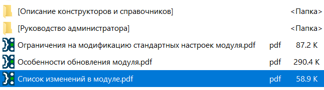

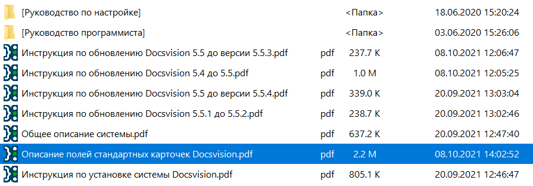

Для дополнительного модуля - Web-клиента документации чуть меньше:

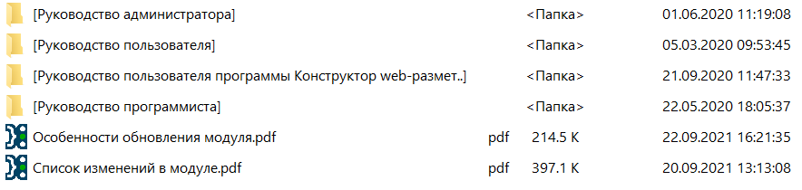

А вот для Службы фоновых операций документации совсем немного:

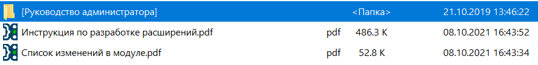

В источнике ничего сверхъестественного: исходные файлы и build.config - конфигурационный файл программы, которая автоматически запускает DITA OT со всеми параметрами.

Markdown:
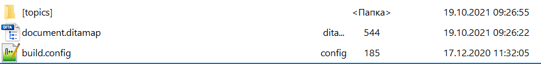
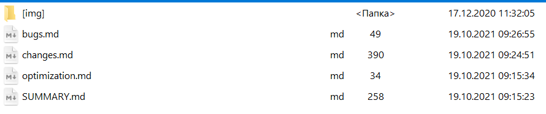

DITA:
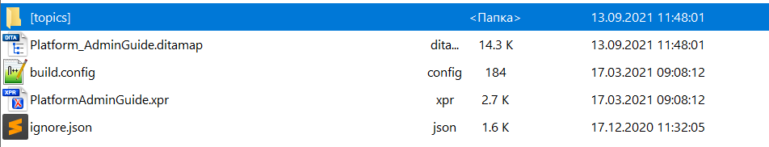
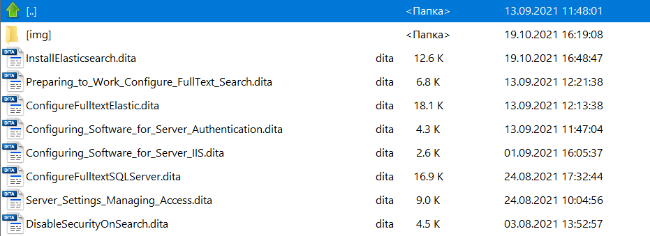


## Чем не устраивает?


Мы решили, что текущий вид документации нас не устраивает.

-   Во-первых, всё в офлайне.
    -   Да, есть html, который мы выкладываем на
        [сайте](https://docsvision.com/docs/webclient/5.5.16/UserGuide/index.html),
        но это не то, потому что есть ещё pdf.
-   Во-вторых, разные исходные форматы.
    -   Хорошо бы оставить только один.
-   В-третьих, нет разбивки на версии.
    -   В репозитории всё удобно, но результирующие файлы лежат в папках
        версий, созданных вручную.

У всех (примеры будут ниже) документация уже давно в онлайне, а мы всё
выкладываем свои pdf да статичные html. Даже наши конкуренты уже
выложили документацию в онлайн. Нужно срочно что-то менять.

Я начал присматриваться к рынку и вывел примерные требования к нашей
новой документации.

## Требования

Примерный список требований к новой документации:

1.  Единый исходный формат документации.

2.  Явное отображение текущей версии документации.

3.  Дата последних изменений.

4.  Страница документации в разработке.

5.  Хлебные крошки для навигации.

6.  Повторное использование текста документации.

7.  Подсветка синтаксиса.

8.  Возможность предпросмотра до публикации онлайн.

9.  Было бы неплохо иметь основное содержание и содержание на странице.

10.  Обязательно поиск по сайту. [Swiftype](https://swiftype.com/),
     [Tipue](http://www.tipue.com/), [Agoolia Docs
     Search](https://docsearch.algolia.com/) (говорят, что быстро
     разворачивается), [Google
     Search](https://support.google.com/customsearch/answer/4513751?hl=en&ref_topic=4513742&rd=1)
     (использовать гуглопоиск может быть весьма удобно и круто).

11.  Было бы очень здорово найти решение для создания диаграмм.

12.  Валидация документов перед публикацией. Проверка на потерянные
     изображения, сломавшиеся ссылки.

*Спойлер: не все требования нашли реализацию в новой документации, но
результат нас полностью устраивает.*

Мы решили не рубить с плеча и делать переход поэтапно. Примерно как на
картинке выше. Документацию к следующему выпущенному модулю мы переведём
на новый формат. А потом подтянутся и другие.

## Понимание задачи
Я просто заходил на случайные сайты с документацией и понял, что нам
нужен генератор статических веб-сайтов.

SSG - Static Site Generator, генератор статических сайтов. Эти штуки
позволяют создать статичный сайт. Мы пишем документацию динамически, но
сайт в интернете расположен статический, т. е. WSIWYG, одна страница --
один исходный документ. Это как экспорт в html из DITA, только лучше.
Лучше тем, что не нужны дополнительные действия -- не нужно отдельно
выкладывать, выполнять специальные операции, а ещё удовлетворяет всем
требованиям.

SSG состоят из:

-   **Среда или платформа** - язык программирования, на котором написан
    сам генератор. Влияет на конфигурацию, кастомизацию и работу
    генератора. Типа, если вы программировали на таком-то языке, то вы
    будете почти знакомы с генератором и сможете лучше им
    воспользоваться. Вариантов достаточно
    [много](https://gist.github.com/briandominick/e5754cc8438dd9503d936ef65fffbb2d).

-   **Система веб-шаблонов** - важно выбирать генератор с такой
    системой, чтобы иметь возможность заимствований и экономии времени.
    Иными словами -- движок. Примеры движков: Liquid, Haml, Slim, Twig.
    Обычно они встроены в SSG.

**Генератор работает так**: Берём исходники в любом формате, редактируем
их, закидываем в репозиторий. Между редактированием и репозиторием
некоторые позволяют иметь предпросмотр, валидацию битых ссылок и прочие
приятные плюшки. Затем Git собирает сайт из исходников в нашем формате,
преобразовывая его в HTML, и публикует онлайн по заданному адресу.

Есть ещё штуки, которые собирают и разворачивают сайты, собранные в
генераторе. Например, [Netlify](https://www.netlify.com/) - один из
самых популярных сервисов.

*Неплохой разбор SSG* [от
GitLab](https://about.gitlab.com/blog/2016/06/10/ssg-overview-gitlab-pages-part-2/)
*(на английском).*

Дальше я приведу примеры сайтов.

## Примеры статических сайтов под наши требования

### DITA OT

[Сайт](https://www.dita-ot.org/colophon) пишется на Markdown и HTML, разворачивается на [Netlify](https://www.netlify.com/). При этом исходники сайта лежат в [репозитории
GitHub](https://github.com/dita-ot/website).

> <..> enriched with Liquid templating tags and styled with Sass. The Bootstrap framework provides the foundation for the site layout. The Jekyll publishing engine combines these plain text components to the final static website you see here.

- Удобно, что есть версия "в разработке" и её может изменить почти
  любой пользователь прямо из браузера.
- Неудобно, что есть и MD, и HTML.
- Удобно, что есть инструкция по разворачиванию, которую можно
  использовать как шаблон.
- Неудобно, что слишком много переменных: Jekyll, Liquid, Bootstrap.

Повторное использование при помощи Liquid и Jekyll, видимо. Нет last
modified, но есть разбивка на версии.

*Иронично, конечно, что сайт DITA Open Toolkit написан на Markdown.*

### YouTrack
Документация [YouTrack](https://www.jetbrains.com/help/youtrack/standalone/2021.4/YouTrack-Documentation.html). На чём сделано - полная загадка, как и повторное использование.

Есть last modified, но нет кем. В принципе, неважно. Есть разбивка на версии, но с самой новой версии нельзя переключиться на версию постарше. Или можно, но в YT документации баг.

Нашёл документацию [IntelliJ Platform SDK](https://plugins.jetbrains.com/docs/intellij/welcome.html), [Исходники в репозитории](https://github.com/JetBrains/intellij-sdk-docs). Суть та же. Но выяснить, как они её разворачивают не удалось.

### GitLab
Сайт документации [GitLab](https://docs.gitlab.com/). Исходники в [репозитории](https://gitlab.com/gitlab-org/gitlab-docs). Написан на Markdown, в создании участвует [Nanoc](https://nanoc.app/doc/tutorial/), который генерирует сайт и [Rouge](http://rouge.jneen.net/), который подсвечивает синтаксис. Есть целая [статья](https://about.gitlab.com/blog/2016/12/07/building-a-new-gitlab-docs-site-with-nanoc-gitlab-ci-and-gitlab-pages/) со всеми подробностями процесса разворачивания. Статью можно изучить очень подробно и попробовать воспроизвести, если захочется такую же конфигурацию.

При публикации используется Ruby в образе на Docker. Тестирование после мержей проходит при помощи [ReviewApps](https://about.gitlab.com/stages-devops-lifecycle/review-apps/) - это собственная разработка GitLab. 

Что-то я понять смог, но в целом это какие-то непонятные мне шаги - различные задания на yaml и много маленьких деталей, которые нужно держать в голове.

Есть разбивка на версии и всё, что душе угодно. Кроме last modified, но это не должно быть особенно сложно добавить.

### GitHub Docs
[Сайт](https://docs.github.com/en/authentication/connecting-to-github-with-ssh/adding-a-new-ssh-key-to-your-github-account) [страница](https://github.com/github/docs/blob/main/content/authentication/connecting-to-github-with-ssh/adding-a-new-ssh-key-to-your-github-account.md) в репозитории.

Есть разбивка на версии в правом углу на весь сайт. Нет last modified и вообще мало информации о том, как это построено. Только Nanoc на своей странице хвастается тем, что GitHub Docs на нём построен.

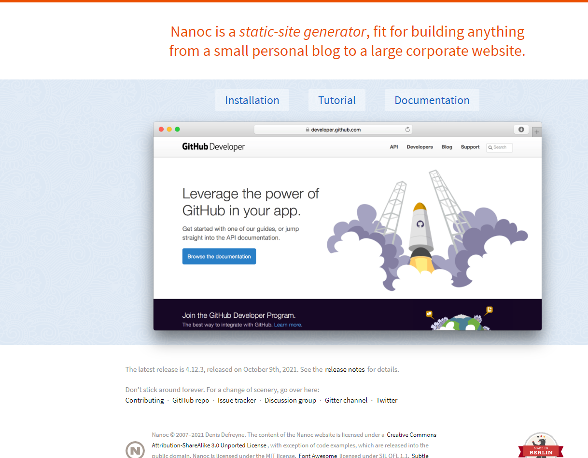

*Страница GitHub Developer перенаправляет на docs.github.com. так что это одно и то же, а у nanoc, похоже, старый скрин.*

### Bootstrap
[Bootstrap docs](https://getbootstrap.com/docs/5.1/getting-started/introduction/) построен на Hugo, написан на Markdown. Репозиторий на [GitHub](https://github.com/twbs/bootstrap/tree/main/site/content/docs). 
Наверное, самый удобный сайт. Есть версионирование, есть меню страницы, правда, нет хлебных крошек. 

Интересно, что основное меню или меню страницы никуда не уезжают, а фиксированы на странице. От Bootstrap я ожидал больших выкрутасов с выезжающими и скрывающимися меню. Но, наверно, чем проще, тем лучше.

На сайте используется поиск от [Agoolia Docs Search](https://docsearch.algolia.com/). Инструкция по разворачиванию для документации есть [вот тут](https://github.com/twbs/bootstrap#running-documentation-locally).

### Prometheus.io
Я хз, что такое [Prometheus.io](https://prometheus.io/docs/introduction/overview/), но для примера я добавил и его. Сайт сделан на Nanoc, для разворачивания требуется Ruby. Всё содержимое в [репозитории](https://github.com/prometheus/docs) на GH. Там же есть инструкция по разворачиванию. Сам сайт написан на Markdown.

Есть содержание страницы, но нет никакого last modified. Разбивка на версии ([там, где она есть](https://prometheus.io/docs/prometheus/latest/getting_started/)) встроена прямо в меню сайта. Можно использовать образец. 

### Jekyll
Логично предположить, что Jekyll (один из самых распространённых SSG для Markdown) и особенно [документация](https://jekyllrb.com/docs/) построены на Jekyll и разворачиваются через GitHub. Есть поиск, разбивка на версии, меню для разнообразия с правой стороны. Есть [небольшая инструкция](https://github.com/jekyll/jekyll/tree/master/docs#running-locally) по локальному запуску, но она что-то не очень подробная. Но есть и инструкции на самом [сайте Jekyll](https://jekyllrb.com/). Создан на Ruby.

### Antora docs
[Очень уютно](https://docs.antora.org/). Можно просто клонировать [репозиторий](https://gitlab.com/antora/antora) и попробовать создать из него. Или использовать Antora из [докера](https://gitlab.com/antora/docker-antora).

### Asciidoc Docs
[Репозиторий](https://github.com/asciidoctor/asciidoc-docs), [сайт](https://docs.asciidoctor.org/asciidoc/latest/syntax-quick-reference/). Инструкция, как собрать есть в документации Antora. То есть можно клонировать и построить сайт, только заменив файлы. Использует на Netlify для разворачивания.

## А ещё SSG могут 
1. [Иметь аутентификацию пользователей](https://firebase.google.com/docs/web/setup/.) Но зачем это сайту с документацией? Ради прикола исключительно.
1. Sitemap и SEO, тогда документацию смогут находить из поисковиков и вовлекаться в продукт. Но это не точно.
1. [Teletext.io](https://teletext.io/) - редактировать контент прямо в браузере. Ну, для этого и репозитории неплохо служат.
1. Контактные формы [Formspree](https://formspree.io/), [FormKeep](https://formkeep.com/), [Wufoo](http://www.wufoo.com/), [FoxyForm](http://www.foxyform.com/), [Google Forms](https://www.google.com/forms/about/).
1. Комментарии Disqus.

## Наши варианты решения
Отлично, рынок я посмотрел, дальше нужно выбирать решение, подходящее именно нам. 

### Решение #1 - HTML/DITA
Ещё раз - сейчас большая часть нашей документации в DITA. Выходные форматы: PDF и HTML. Если просто выгрузить в онлайн HTML-файлы, настроить Git Pages, то мы получим готовый сайт с минимумом усилий.

**Плюсы**: Минимум усилий, не потребуется менять формат документации, можно не настраивать UI, т.к. он уже готов. Из Markdown при помощи DITA-OT тоже без проблем можно создать HTML.

**Минусы**: Если решим что-то изменить, то придётся настраивать DITA OT, XSLT. В DITA OT и XSLT преобразованиях я не силён, я вообще мало чего в них понимаю, потому что унаследовал всё от коллеги. Всегда можно спросить коллегу, но тварь я дрожащая или моя обязанность сделать всё самостоятельно?!. К тому же при таком раскладе исходники и конечный результат разделены. Придётся либо придумать способ автоматизации сборки из исходников документации и публикацию результата в другой репозиторий, который будет собираться в сайт, либо как-то иначе настроить процесс сборки документации, чтобы документация из исходников собиралась в сайт. Разбивка на версии тоже по умолчанию будет отсутствовать, потребуется допиливать. Не хотелось бы.

#### Пример сайта на DITA
Можно попробовать построить сайт на DITA при помощи стороннего софта. Порывшись в гугле, я нашёл [Heretto](https://heretto.com/) - генератор статических сайтов, созданный специально для DITA. Когда я искал решения это ещё была [easyDITA](https://docs.easydita.com/docs/user-guide/194/publish/static-site-generator-ssg), информации было очень мало. Но после ребрендинга они как будто бы взялись за продвижение и теперь даже [на YouTube](https://www.youtube.com/watch?v=W37LFsB3bv4&ab_channel=Heretto) есть их руководства. Но это совсем не интуитивное и очень громоздкое решение. К тому же оно платное. Ка-нибудь обойдёмся.

Единственный пример сайта на DITA я нашёл - это [LearningDita](https://learningdita.com/). Исходники в [репозитории](https://github.com/ScriptoriumDev/LearningDITA) GitHub. Исходники пишутся на DITA, сайт работает на WordPress, для публикации используются XSLT трансформации.

Но толку от такого сайта мало. Нет разбивки на версии, нет last modified. И, опять же, решение громоздкое.

### Решение #2 - Jira
Документация на Confluence, удовлетворяет всем нашим требованиям - есть last modified, можно даже организовать разбивку на версии и повторное использование.

- [Разбивка на версии](https://www.k15t.com/rock-the-docs/versioning)
- [Повторное использование](https://www.k15t.com/rock-the-docs/content-reuse)
- [Публикация](https://www.k15t.com/rock-the-docs/publishing/publish-your-content-as-a-help-center-with-scroll-viewport)

Но это отдельная стоимость и решение закрытое, хотелось бы open source.

### Решение #3 - Markdown
Небольшая часть документации у нас уже на MD. Почему бы не конвертировать всю документацию в этот формат?

Конвертировать в MD из DITA можно c использованием преобразования, которое есть в DITA OT.

Без дополнительных настроек получаем следующее:

- Примечания (admonitions: Note, important и т.д.) вообще никак не конвертируются, остаётся только подпись жирным Note.
- Удаляется почти всякое форматирование: моноширинный, курсив и т.д.
- Зато сохраняются картинки.

  Пример конвертации:

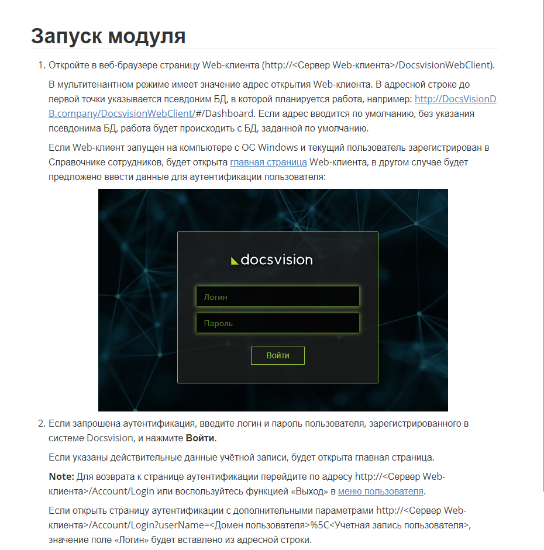

Можно доработать XSLT трансформацию, чтобы на выходе MD файлы получались без изъянов. В итоге мы получим идеальный MD на выходе, но это потребует дополнительных трудозатрат. Также не следует забывать, что всё равно MD ещё нужно будет дорабатывать через SSG. А ещё есть факт того, что MD - очень простой формат и использовать его для серьёзной документации - это всё равно что создавать вечный двигатель.

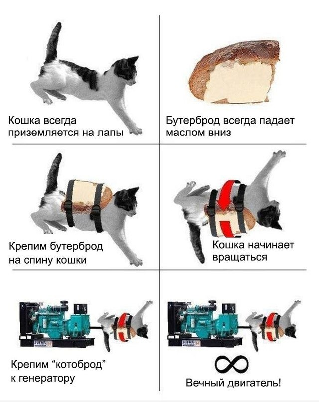

Но мне всё равно хотелось сравнить все плюсы и минусы.

**ЗА MD:**

- Некоторые руководства уже в MD.
- Совсем простой синтаксис.
- Поддерживается GitHub.
- Можно применить трансформацию DITA OT и конвертировать всё разом.

**ПРОТИВ MD:**

- Большое количество разновидностей т.н. flavors.
- Совсем простой синтаксис. Многое (перекрёстные ссылки на разделы топиков, например) придётся изобретать при помощи SSG или ещё как-то.
- Руководств в MD у нас не так много (я бы оценил в 10-20 процентов, но это не точно).
- Для более-менее достойного результата нужно будет настроить XSLT трансформацию. 
  Это трудоёмко и я не знаю ничего о настройке XSLT.
- Перспектива поддерживать всю документацию в MD выглядит не очень внушительно.
  Разобраться движками, настройками и прочими крутилками вряд ли будет очень просто вне зависимости от формата. Но писать всю документацию в MD слишком просто. Документация для нашей системы - это более сложная вещь, чем чистый MD.
- Очень часто нужно переключать раскладку, чтобы обозначить заголовок. После таких сложных действий я нередко путаюсь в том, на каком языке печатаю. А ещё пробелы. Бесконечное количество пробелов, которые визуально считать сложнее, чем символы.

## Следующие действия (упрощённо)
Получается примерно следующий алгоритм действий, которые нужно выполнить для перехода на новую документацию:

1. Выбираем новый формат документации.
1. Находим SSG под этот формат.
1. Смотрим, можно ли повторно использовать.
1. Определяем структуру папок, поддерживаемую выбранным SSG.
1. Находим инструкцию, а лучше примеры, как сделать сайт на этом формате с этим SSG.
1. Находим редактор под выбранный формат, чтобы было удобнее работать.
1. Конвертируем документацию.
1. Создаём сайт по инструкции для SSG.

Обычно всё оказывается не так просто в действительности, но посмотрим.

## Какие ещё форматы могут быть использованы для создания статических сайтов?
Если конвертировать всё равно придётся, то сначала нужно определиться с форматом. Выбор формата - это по сути выбор [SSG](https://gist.github.com/briandominick/e5754cc8438dd9503d936ef65fffbb2d). Каждый формат поддерживается определёнными SSG. 

Есть разные форматы-языки, есть даже пара Wiki. *Я нашёл, какие форматы поддерживает GitHub, чтобы определиться с форматом документации и идти от него:*
- [.md](https://daringfireball.net/projects/markdown/) - проще и очевиднее всего. Несмотря на то, что MD - простой формат, многие сайты написаны на нём. Но какую разновидность MD выбрать и как она будет поддерживаться? [CommonMark](https://commonmark.org/), [kramdow]n(https://kramdown.gettalong.org/), [оригинальный Markdown Грубера](https://daringfireball.net/projects/markdown/syntax), [markdown для Gitub](https://github.github.com/gfm/), [Multimarkdown](https://fletcherpenney.net/multimarkdown/).
- [.textile](https://www.promptworks.com/textile/writing-paragraph-text) - условно это почти тот же самый markdown, только без пробелов и с более вербальной структурой: `h2., bq.. .p`.
- [.rdoc](https://ruby.github.io/rdoc/) - я честно пытался понять, но не смог. Что-то слишком сложное для создания документации.
- [.org](https://orgmode.org/) - на беглый взгляд выглядит как интересная вещь, списки с чекбоксами, todo списки, даже макросы и тэги. Но, чтобы разобраться подробнее, понадобится немало времени. Очень большой потенциал, много возможностей, но использовать только маленькую часть целого потенциала не хочется.
  *Сайт на английском, французском и японском. Интересный выбор языков.*
- [.creole](http://wikicreole.org/) - невнятная штука, которая не развивается с 2008 года. А один из создателей даже обиделся, разругался c остальными и ушёл. Драма прямо на [страницах](http://wikicreole.org/wiki/RadomirDopieralski) самой wiki. Зачем GitHub это до сих пор поддерживает - загадка.
- [.mediawiki](https://www.mediawiki.org/wiki/Help:Formatting) - любопытная штука, если хочется развернуть свою wiki. Современная, с доступным руководством и в целом приятная. Есть открытые [исходники](https://phabricator.wikimedia.org/source/mediawiki/), есть [руководство](https://www.mediawiki.org/wiki/Manual:Contents). Но вики - это, наверно, не совсем тот формат, который нужен нам. Зато будет очень удобно добавлять новые переводы, если мы будем писать документацию на нескольких языках в будущем.
- [.rst](https://docutils.sourceforge.io/docs/user/rst/quickref.html) - мощный инструмент. Тот самый, который используют в пиратских релизах на торрентах. Но чтобы его применить по назначению, а тем более создать из него сайт, например на [Sphinx](https://www.sphinx-doc.org/en/master/), потребуется много серьёзного вдумчивого изучения.
- [.pod](https://metacpan.org/pod/perlpod) - чутка сложная для понимания штука. Можно встретить простые вещи вроде заголовков и капец какие сложные вещи с тэгами и непонятными формулами. Влиться просто так в тему не получится. И вообще на страницах сайта в футере какая-то рекламная фигня - несолидно.
- [.asciidoc, .adoc, .asc](https://docs.asciidoctor.org/asciidoc/latest/syntax-quick-reference/) - почти такой же простой, как Markdown, но имеет точную спецификацию, большее разнообразие выходных форматов (на всякий случай) и более мощный из коробки - есть, например, атрибуты, ID и другие плюшки. Постоянно развивается и имеет живое сообщество.

Я решил остановить выбор на AsciiDoc (.adoc).

## Я определился!

- Многое из того, что DITA делает через XSLT (а в MD отсутствует полностью) в AsciiDoc работает из коробки и делается одной строкой. Подписи типа "Рисунок X", номера разделов, перекрёстные ссылки, ключи, передвинуть уровни разделов: всё можно сделать одной строкой.
- Синтаксис легче, чем MD. Тут я ещё нашёл IntelliJ Idea (бесплатное и OpenSource Commuity Edition) - IDE от JetBrains и плагин AsciiDoc для неё. Работа в этом IDE в сочетании с плагином облегчает работу с AsciiDoc и при этом не упрощает визуально структуру документа (камень в огород oXygen). Просто чистый язык форматирования/разметки и идеальная поддержка (можно напрямую общаться с разработчиками).
- С IntelliJ Idea ещё и проверка орфографии лучше, чем в Typora Sublime Text, Notepad++ и Oxygen вместе взятых.
- И предпросмотр лучше, чем в Typora или Sublime Text.
- AsciiDoc также поддерживается GitHub и конвертируется в документ из кода.
- Есть одна чёткая версия документации.

Определившись с форматом, я определился и с SSG - Antora. Antora - единственный SSG, работающий с AsciiDoc. Примеры сайтов на Antora есть в разделе "примеры" выше - это [Antora](https://docs.antora.org/), [AsciiDoctor](https://docs.asciidoctor.org/home/) и [многие другие](https://antora.zulipchat.com/#narrow/stream/282403-announce-.F0.9F.93.A2/topic/docs.20sites), как я выяснил позже. Antora может обрабатывать сразу несколько репозиториев, имеет возможность повторного использования. А ещё поддержка Antora встроена в IntelliJ Idea.

### Конвертация через Pandoc

Всё ещё остаётся вопрос с конвертацией из DITA. Тут на помощь приходит [Pandoc](https://pandoc.org/). Он не работает с DITA напрямую, но он работает с HTML, а мы можем из DITA сделать HTML.

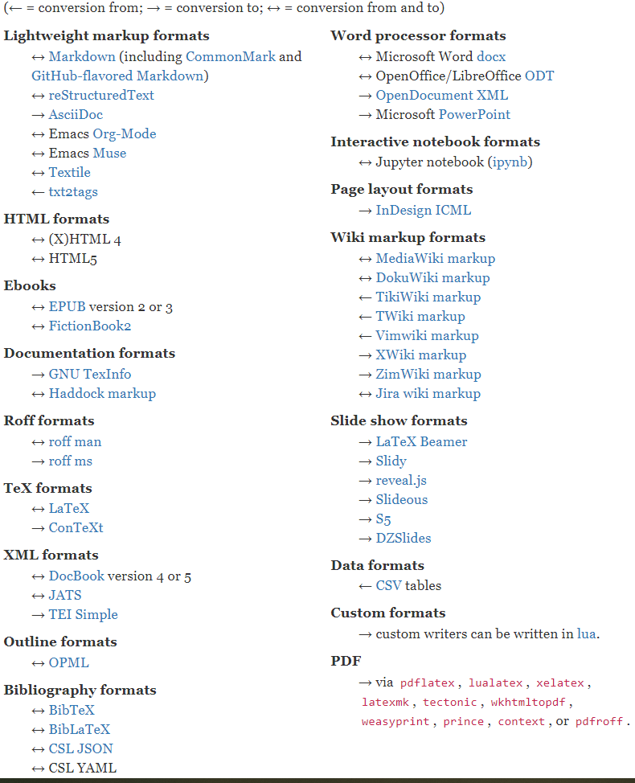

Windows при конвертации с использованием Pandoc чудит с кодировками так, что на выходе получается нечитаемое. Чтобы обойти эту проблему, нужно изменить стандартную команду:
`pandoc -f html -t asciidoc .\index.html > ..\output\test.adoc`
на:
`pandoc -f html .\index.html  -o ..\output\test.adoc`

#### Пакетная обработка файлов

Чтобы обрабатывать файлы пачками, а не по одному, нужно создать bat-файл для консоли со следующим содержимым:

```bat
@ECHO OFF
SETLOCAL
SET "sourcedir=.\"
PUSHD "%sourcedir%"
FOR /f "delims=" %%a IN (
 'dir /b /s /a-d *.md *.html '
 ) DO (
 IF /i "%%~xa"==".md" (
  IF NOT EXIST "%%~dpna.html" pandoc "%%a" -f markdown -t asciidoc -o "%%~dpna.adoc"
 ) ELSE (
  IF NOT EXIST "%%~dpna.MD" pandoc "%%a" -f html -t asciidoc -o "%%~dpna.adoc"
 )
)
popd
GOTO :EOF
```

> **Важное замечание: ** Я конвертировал из простого HTML. Так результат получается чуть более приличным, чем при конвертации из нашего кастомного XSLT шаблона.

### Недостатки конвертации

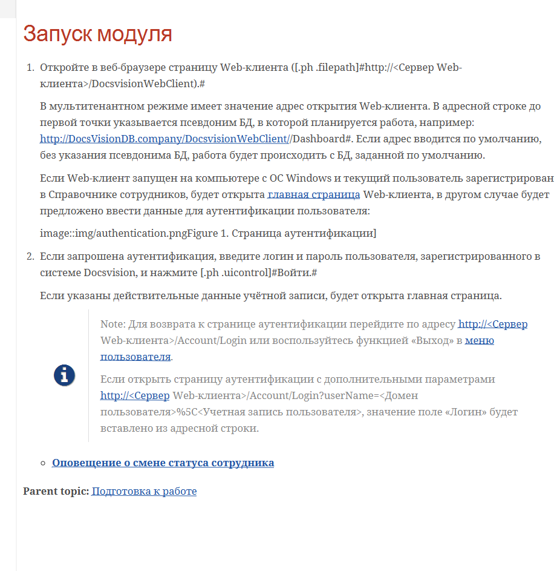

После двойной конвертации остаются артефакты:

1. Ссылки автоматически не переделываются. 
    Например: `topic.html` не будет автоматически сконвертировано в `topic.adoc`. Не большая проблема, но в документации есть же ещё ссылки на страницы в интернете. Нельзя просто взять и заменить все \*.html на \*.adoc. *Спойлер: можно, просто потом нужно немного посмотреть сконвертированное, почитать, поправить. Я был даже рад возможности убрать лишние формулировки, где-то упростить и т.д.* 
1. Оглавление формируется с небольшими ошибками (link::topics/topic.adoc вместо xref::topic.adoc). Но это дело нехитрое. Нужно только сделать простую замену.
1. Из DITA названия элементов переносятся в HTML и добавляются к каждому элементу как отдельный класс. Вроде `<span class="term">Акт</span>`. Это немного мешает, но .adoc поддерживает классы, поэтому они конвертируются почти без проблем. Единственная проблема - это много лишних решёток `#`, которые лезут изо всех щелей.
   Например: `<span class="term">Акт</span>` должно быть курсивом. Курсив в AsciiDoc обозначается `_`. Но при конвертации получится `[.dfn .term]#Акт#`, а если это конец абзаца, то будет вообще `[.dfn .term]#Акт#.##`.
1. Картинки отображаются неправильно иногда, но это опять же не великая проблема.

Далее я приведу пару скриптов для замены некоторых артефактов конвертации. Скрипты были взяты из открытых источников и доработаны мной, сообществом и моими коллегами.

#### Удалить ID
Скрипт удалит все лишние `[[ariaid-title1]]` и заменит `link:topics/` на `xref:` и вообще все `link:` на `xref:`.

```powershell
Get-ChildItem -Path *.adoc -file -recurse | ForEach-Object {

 $lines = Get-Content -Path $PSItem.FullName -Encoding UTF8 -Raw

 $patterns = @{
  '(\[\[ariaid-title1\]\])' = '' ;
  '(img/)' = '' ;
  '(link:topics/)' = 'xref:';
  '(link:)' = 'xref:';
  
 }
 $option = [System.Text.RegularExpressions.RegexOptions]::Singleline

 foreach($k in $patterns.Keys){
   $pat = [regex]::new($k, $option)
   $lines = $pat.Replace($lines, $patterns.$k)
 }

[IO.File]::WriteAllText($PSItem.FullName, $lines)

 }
```

#### Простые замены

Есть скрипт для Powershell, который заменит все `[.dfn .term]#Акт#` на `[.dfn .term]_Акт_` и тому подобные сочетания.

Скрипт следующий:

```powershell
Get-ChildItem -Path *.adoc -file -recurse | ForEach-Object {

$lines = Get-Content -Path $PSItem.FullName -Encoding UTF8 -Raw

$patterns = @{
 '(\[\.dfn \.term])#(.*?)#' = '$1_$2_' ;
 '(\[\.keyword])#(.*?)#' = '$1*$2*' ;
 '(\[\.ph \.filepath])#(.*?)#' = '$1`$2`' ;
 '(\[\.ph \.uicontrol])#(.*?)#' = '$1*$2*' ;
 '(\[\.keyword \.parmname])#(.*?)#' = '$1_$2_' ;
 '(\[\.keyword \.wintitle])#(.*?)#' = '$1*$2*' ;
 '(\[\.kbd \.ph \.userinput])#(.*?)#' = '$1`$2`' ;

}
$option = [System.Text.RegularExpressions.RegexOptions]::Singleline 

foreach($k in $patterns.Keys){
  $pat = [regex]::new($k, $option)
  $lines = $pat.Replace($lines, $patterns.$k)
}

[IO.File]::WriteAllText($PSItem.FullName, $lines)
}
```

***Примеры более сложных элементов, которые необходимо обработать после:***

После обработки скриптом возникнут трудности с более сложными элементами.

1. `[.ph .menucascade]#[.ph .uicontrol]#Документ# > [.ph .uicontrol]#Документ УД# > [.ph .uicontrol]#Акт##`
   
   В идеале бы заменить `menu:Документ[Документ УД > Акт]`.

#### Подчёркивание

Из HTML в AsciiDoc подчёркивание конвертируется как `+++по дате создания+++`. Должно быть `[.underline]#по дате создания#`, но лучше заменить на что-то ещё, т.к. выделение подчёркиванием в документации, оказывается, устарело. 

#### Специфика DV

`[.ph .filepath]#http://DocsVisionDB.company/DocsvisionWebClient/#/Dashboard#`

`#/Dashboard` портит работу скрипта. Строка в результате будет такого вида:

```[.ph .filepath]`http://DocsVisionDB.company/DocsvisionWebClient/`/Dashboard#```

А ещё AsciiDoc не воспринимает `#` в адресе `DocsvisionWebClient/#/Dashboard`. В таких случаях надо менять `#` на `#&#35;` или эскейпить `/\#/`.

#### Другие доработки

- `[.ph]`- лучше убрать
  Не мешает в таком виде:
```
   [.ph]#при копировании или вырезании другого# раздела.
```

  Но в таком виде `[.ph]` сильно мешает:

```
   [.ph .cmd]#Измените поля
   [.ph]#[#RenameSectionNomenclature__d8e33 .kbd .ph .userinput]#Индекс
   раздела#,
```

  Это редкие случаи, но важные.  Потому что даже после полного редактирования возникают ошибки:

  **ДО РЕДАКТИРОВАНИЯ**

  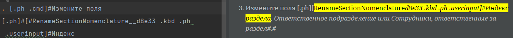

  **ПОСЛЕ РЕДАКТИРОВАНИЯ**

  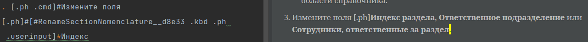

   Сложность в том, что скрипт не найдёт такой `.userinput`, его придётся вручную обрабатывать. Унифицировать тоже сложно, потому что первая часть `[#RenameSectionNomenclature__d8e33` зависит от названия файла. `__d8e33` тоже каждый раз уникальное значение. Легче вручную проверять.

- `[.ph .cmd]` - можно оставить, но лучше убрать, потому что зачем оно надо
```
   [.ph .cmd]#Если запрошена аутентификация, введите логин и пароль
   пользователя, зарегистрированного в системе Docsvision, и нажмите
   [.ph .uicontrol]#Войти#.#
```

Но можно и оставить. Это будут так называемые [кастомные роли](https://docs.asciidoctor.org/asciidoc/latest/text/custom-inline-styles/#custom-style-syntax) в AsciiDoc. К ним можно применить особый CSS, что может быть удобно, если такой уже имеется для DITA и хочется сохранить вид как после DITA.

#### Изображения
**Решение:** Использовать скрипт в следующих случаях нет смысла по-моему. Тут либо руками, либо сразу предусмотреть такие моменты при конвертации, [используя](https://pandoc.org/using-the-pandoc-api.html#) [API Pandoc](https://hackage.haskell.org/package/pandoc). А ещё можно поиском из IntrelliJ убрать, просто через CTRL+SHIFT+R.

Конвертация будет выдавать вот такой однострочный макрос для изображения:

> image::img/dcard_delete_button.png[[.fig--title-label]##Рис. 1. ##Кнопка
> удаления карточки]

Точнее он должен быть однострочным, но получается в несколько строк:
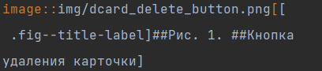

После слова кнопка есть перенос строки и из-за этого изображение не отображается. Можно просто убрать этот перенос строки и будет достигнута цель - изображение будет видно в результате.

Но лучше сделать по красоте. По красоте - это превращать каждый макрос изображения в такой вот:

> [#authentication]
> .Страница аутентификации
> image::img/authentication.png[Страница аутентификации]

HTML исходник выглядит так:

```html
<div class="itemgroup info">
 <figure class="fig fignone">
        <figcaption>
            <span class="fig--title-label">Figure 1. </span>
            Страница аутентификации
        </figcaption>
        <br>
        
        <br>
    </figure>
</div>
```

То есть желательно сделать следующее:

1. Взять имя файла без расширения, поместить его в квадратные скобки после решётки `#`.
   Это будет ID блока изображения.
1. Добавить перенос строки.
1. На новой строке добавить точку `.`, после неё без пробела указать текст подписи, который идёт внутри `<figcaption>Страница аутентификации</figcaption>`.
   `<span class="fig--title-label">` проигнорировать полностью.
   Это будет подпись под изображением.
1. Добавить перенос строки.
1. На новой строке добавить ссылку на изображение `image::img/authentication.png ` и квадратные скобки.
1. В квадратных скобках указать текст подписи, который идёт внутри `<figcaption> Страница аутентификации </figcaption>`.
   `<span class="fig--title-label">` проигнорировать полностью.
   Это будет ALT текст изображения.

Удачи в автоматизации этого добра))

#### Примечания
У примечаний  (note) образовались заголовки `[.note__title]#Прим.:#`. Такие заголовки надо убирать.

Но если заголовок вида `[.note__title]#Important:#`:
```
   [NOTE]
   ====
   [.note__title]#Important:#Заметка
   ===
```

Нужно заменить в примечаниях слово `NOTE` на слово `IMPORTANT` (обязательно капсом). Заголовок `[.note__title]#Important:#` удалить:

```
[IMPORTANT]
====
Заметка
====
```

Или заменить вот такое:
```
   [NOTE]
   ====
   [.note__title]#Важное замечание:# Возможности форматирования комментариев и упоминания сотрудников доступны, только если включена экспериментальная функция «Контрол комментарии с html редактором».
   ====
```

На вот такое:
```
   IMPORTANT: Возможности форматирования комментариев и упоминания сотрудников доступны, только если включена экспериментальная функция «Контрол комментарии с html редактором».
```

Но надёжнее будет первый вариант, с блоком, т.к. примечания могут быть в несколько строк.

#### Menucascade
В AsciiDoc есть макрос для меню:

```
menu:Вася[Открыть > Закрыть]
```

Чтобы он правильно работал, нужно включить атрибут `:experimental:`.

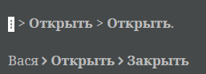

Но из DITA через HTML выходит такое:

```
[.ph .menucascade]#[.ph .uicontrol]*image:buttons/verticalDots.png[image]* > [.ph .uicontrol]*Открыть*#.
```

Можно заморочиться и заменить всё menucascade на правильные, если вам это надо. Так как я хотел всё по красоте, то я заморочился и заменял все эти недостатки вручную.

Впрочем, есть ограничения. В AsciiDoc макрос меню нельзя затолкать изображение (на самом деле можно, но это не рекомендуется создателями). В таком случае придётся либо описательно называть кнопки, либо изворачиваться как-то ещё.

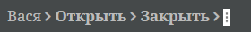

Извернуться можно вот так: `menu:{zwsp}pass:m[image:dots.png[\][.ph .uicontrol]*Открыть* > [.ph .uicontrol]*Закрыть*]`.

## Заключение

Как славно всё начиналось и как много нюансов и мелких сложностей оказалось в итоге! Но это ещё не всё, самое время начать строить сайт при помощи Antora. Об этом я расскажу подробнее в следующей статье. Я поделюсь тем, как организовать файлы, как настроить UI и, что очень важно, как прикрутить поиск. Сделанным выбором я остался доволен. Antora и AsciiDoc вместе - это просто песня.