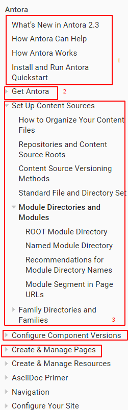
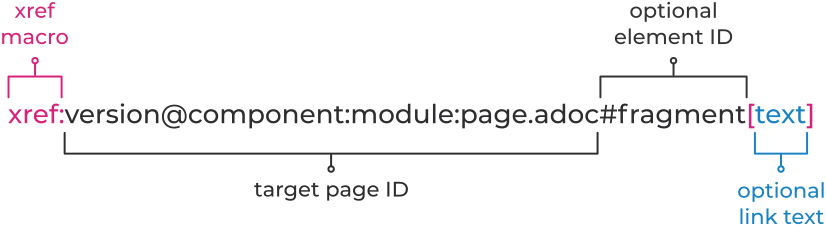
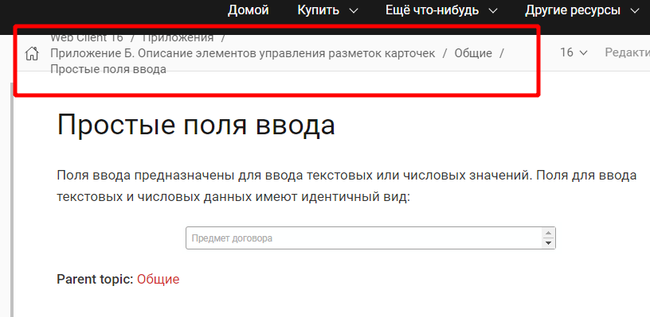

# Новая документация Docsvision ч. 2 -- Antora

[В первой статье](https://habr.com/ru/post/589457/) я рассказал, как мы выбирали SSG для создания новой документации и как нам пришлось конвертировать DITA сначала в HTML, а потом в AsciiDoc.

В этой статье я расскажу, как я начал работать с SSG Antora, как я настраивал UI и добавлял сквозной поиск по сайту.  

## С чего начать работу с Antora?

С раздела на сайте документации Antora, который так и называется ["с чего начать"](https://docs.antora.org/antora/2.3/#where-to-begin).

В статье я не буду подробно описывать то, как организовать файлы по папкам, в чём отличие playbook от component version descriptor и т.д. - это всё прекрасно описано в документации Antora. Опишу базовые шаги, необходимые для понимания работы: 

1. Сперва нужно установить Antora.

   Проверить NODE LTS: `node --version`

   Установить Антору: `npm i -g @antora/cli @antora/site-generator-default`

3. Затем прочитать документацию. Лучше прочитать всю целиком, а не только Quick start guide, чтобы лучше понять Antora в целом.

4. Адрес сайта будет выглядеть следующим образом: 
   
   **url сайта** - например, https://dv-docs.com;

   **name of  component** - модуль, например, webclient;

   **name of version** - версия, например, 16 или 17 - указывается в antora.yml;

   **name of module** - тип руководства, например, user, admin, layouts;
   
   **name of page** - например, intro.

## Структурирование файлов

Я прочитал [документацию](https://docs.antora.org/antora/2.3/organize-content-files/) и примерно представил то, как будут организованы наши исходные файлы. 

Разные модули ДВ = разные **компоненты** анторы.

Разные руководства модулей ДВ = разные **модули** анторы.

Разные **компоненты анторы** версионируются и отображаются в отдельном меню. 

Разные **модули анторы** отображаются разве что только в адресе сайта, в навигационном меню они никак не выделяются.



Для нас это значит, что руководство пользователя, админа и конструктор разметок будут склеены в единое содержание.

Отсюда у нас два варианта: создавать каждое руководство в качестве отдельного компонента с одним-единственным модулем или смириться с общим содержанием и делать руководства по модулям.

Я остановил выбор на втором варианте.

Сначала мы переводим на новую документацию web-клиент. Следующая релизная версия web-клиента будет под номером 17, пока она в разработке, то есть в ветке develop.

Так и поступим. Исходники я организовал следующим образом:

Я решил сделать для документации каждого модуля ДВ свой репозиторий, а версии хранить в разных ветках. 

Ветка *Develop* - ветка документации для ВК17.

*antora.yml* - файл, расположенный в корне каждой ветки.
Для каждой новой ветки нужно будет создать свой уникальный *antora.yml* файл, указывающий на версию и её свойства. 

> !!! В пути до файла antora.yml не должно быть посторонних символов, кроме латинских букв, цифр, короткого тире (-). Пробелы не разрешаются, решётки (#) тоже. Иначе ничего не будет собираться.

Таким образом обеспечиваются *component versions*, т.е. разбивка на версии.

В корне репозитория нужно создать папку **modules** (регистр важен).

В папке **modules** можно создать сколько угодно подпапок.
Каждая папка - отдельный модуль antora. В нашем случае каждый модуль Antora - отдельное руководство пользователя, админа, конструктора разметок.

Для каждого модуля нужно создать свой файл навигации. Файл навигации представляет собой обычный многоуровневый список. Создавать содержание с нуля для больших руководств не очень хочется. К счастью, после конвертации получается файл **index.adoc**, он отлично подходит в качестве файла навигации. Но есть "но":

- Имена папок в структуре Antora отличаются от сконвертированных. В пути до файла нужно убрать `topics/`, но оставить всё, что после.
- Ссылки `link:` нужно заменить на `xref:`.
- Расширение `html` заменить на `.adoc`.

## Переделки под Антору

По ходу конвертации и подстраивания документации под Антору выяснилось, что нужно переделать ещё многое.

По тексту добавить перекрёстные ссылки на другие модули и компоненты в формате:



Одинаковые страницы в модулях можно добавить в навигацию аналогичным образом: `xref:version@component:module:filename.adoc[]`. Но лучше делать include всей страницы полностью: `include::version@component:module:filename.adoc`. Иначе будут ситуации, например, когда пользователь смотрит документацию модуля web-клиент, а потом переходит по ссылке в навигации и внезапно попадает на документацию модуля Платформа. Пользователю потребуется время, чтобы осознать, где он и как вернуться назад.

Ещё одна важная мелочь - заголовки страниц.
После конвертации все заголовки страниц второго уровня и дальше. Потребуется вычесть один уровень из каждого заголовка вручную.
Есть, конечно, обходной путь - использовать `:leveloffset:`. `:leveloffset:` можно даже задать для компонентов, то есть в **antora.yml** файлах, но лучше всё же делать по-красоте сразу и без костылей.

Есть ещё блоки с исходным кодом. Они выделяются знаками равно после конвертации: `====`, такое надо заменить на `----`.

Исходный код должен выглядеть так:
```
[source,yaml] 
----
code here
----
```

Нужно будет ещё исправить путь до изображений - убрать `img/` из `img/image.png`, иначе изображения не будут работать.

Если делать по-красоте, то хорошо бы переделать имена файлов с нижнего подчёркивания на дефис: `a_file_name.adoc` заменить на `a-file-name.adoc`.

Добавить `kbd:[Ctrl+Shift+N]` для клавиш и сочетаний клавиш.

Работы ещё много, но в итоге всё окупится.

## Разбивка на версии (antora.yml)

Честно говоря, я боялся, что мне придётся изучать ещё и YAML во всех подробностях, но оказывается, что нет.

Оказывается, файлы **antora.yml** и **playbook.yml** сочиняются на YAML, очень просто. Процесс составления **antora.yml** описан в [документации Antora](https://docs.antora.org/antora/2.3/organize-content-files/).

Файл уникален для каждой ветки репозитория (main, WC17 и т.д.), лежит в корне репозитория, в каждой ветке.

Содержимое примерно такое:

```yaml
name: webclient
version: '16'
title: Web Client 16
asciidoc:
  attributes:
    toclevels: 10
    sectids: ''
    sectlinks: ''
    sectanchors: ''
    toc-title: Содержание
    figure-caption: Рисунок
    appendix-caption: Приложение
    wc: WebClient
    dv: Docsvision
nav: 
- modules/user/nav.adoc
- modules/admin/nav.adoc
start_page: user:Capabilities.adoc
```

Порядок ключей не имеет значения.

## Playbook

Процесс составления описывается в [документации Antora](https://docs.antora.org/antora/2.3/playbook/).
Я ожидал больших сложностей. Но всё оставались вопросы, которые мне были не совсем очевидны. Но сейчас я уверенно могу на них ответить:

- Куда сохранять книгу? 
  - Рекомендуется держать под книгу отдельный репозиторий.
  
- Как быть с доменом? Его нужно купить, но как посмотреть перед публикацией? Как быть с DNS-записями?
  - Можно запустить сайт на локальном сервере в тестовых целях. Можно просто посмотреть страницы сайта в офлайне. С доменом уже потом разбираться будут специально обученные люди.
  
- Можно ли подключить аналитику?
  - Да, через ключ yaml в playbook, типа так:
```yaml
    keys: 
    	google_analytics: XX-123456
```

- Как защищённое соединение обеспечивается? `S` в http**s**://
  - Специально обученные люди разберутся.
  
- Где во всём этом процессе стоит сервер?
  - Специально обученные люди разберутся. Нужно уметь разделять обязанности и не взваливать лишнее на себя.
  
- Ссылка "Edit this page". Как её кастомизировать?
  - В UI, там будет понятно.
  
- Стили, иконки и прочая мишура
  - Всё делается в UI bundle. Он легко кастомизируется, после чего его надо упаковать и добавить в playbook вот так:
  
```yaml
  ui:
  bundle:
    url: /home/user/projects/docs-ui/build/ui-bundle.zip
```

Готовый файл playbook выглядит примерно вот так:

```yaml
site:
  title: Docsvision Docs
  url: https://docsvision.github.io/docs-playbook/
  start_page: webclient:user:welcome.adoc
  robots: allow
content:
  sources:
  - url: https://github.com/Docsvision/docstest.git
    branches: [main, WC*]
ui:
  bundle:
    url: https://gitlab.com/antora/antora-ui-default/-/jobs/artifacts/master/raw/build/ui-bundle.zip?job=bundle-stable
    snapshot: true
asciidoc:
  attributes:
    toclevels: 10
    sectids: ''
    sectlinks: ''
    sectanchors: ''
    toc-title: Содержание
    icons: font
    figure-caption: Рисунок
    appendix-caption: Приложение
    wc: WebClient
    dv: Docsvision
urls:
  html_extension_style: indexify
output:
  dir: ./site
runtime:
  fetch: true
```

Порядок ключей не имеет значения. Подробное описание ключей читайте в [документации Antora](https://docs.antora.org/antora/2.3/playbook/).

## Сборка сайта

Перед созданием сайта нужно убедиться, что выполнены следующие требования:

- Созданы исходники в формате .adoc, включая навигацию (можно и без навигации, но зачем?).
- Создан файл с описанием версий компонента.
- Создан playbook.

Убедившись, что все требования выполнены, достаточно просто натравить Антору на файл playbook вот так: `antora the-playbook.yml`.

После выполнения команды Антора получит информацию из указанных источников:

   ```yaml
content:
  sources:
  - url: https://github.com/Docsvision/docstest.git //где хранятся исходники
    branches: [main, WC*] //какие ветки обрабатывать
   ```

И опубликует их по адресу, указанному вот тут:

 ```yaml
site:
  url: https://docsvision.github.io/docs-playbook/
 ```

Если есть какие-то ошибки в исходниках, Антора выведет их прямо в консоли. Также нужно помнить, что по умолчанию Антора кэширует UI. Чтобы такого не было, нужно ставить `snapshot: true`:

```yaml
ui:
  bundle:
    url: https://gitlab.com/antora/antora-ui-default/-/jobs/artifacts/master/raw/build/ui-bundle.zip?job=bundle-stable
    snapshot: true
```

А ещё Антора кэширует исходники. Чтобы потом не было так: "Но как же! Я же исправлял эту ошибку! В чём дело? Что ещё нужно исправить?". Делайте вот так:

```yaml
runtime:
  fetch: true
```

Сайт готов. Остаётся только сделать commit/push. 

А также при желании:

- изменить текст страницы 404
- изменить текст ссылки "Edit this page"

Об этом чуть ниже, через три небольших пункта.

## GitHub Pages

GitHub Pages работают с Jekyll, который удаляет все файлы и папки, начинающиеся с `_`. Антора в этой папке хранит весь UI. То есть по умолчанию весь UI будет удалён этим самым Jekyll. Решение простое, нужно только добавить в корень репозитория сайта файл `.nojekyll`.

Я поместил всю документацию в корень репозитория тоже на всякий случай. Иначе у меня сайт не хотел заводиться. Но так даже лучше, потому что адрес вышел короче.

## .html to .adoc

При изначальной конвертации из dita в html в adoc остались html артефакты. Например, любая перекрёстная ссылка превращалась в `link:ololo.html[trololo]`.  IntelliJ нормально съедала такие ссылки и не ругалась, нормально делала превью и т.д. Но после создания сайта через Antora все ссылки ломались.

Требовалась замена всех таких ссылок на правильные: `xref:ololo.adoc[trololo]`. Проблема легко решается заменой всех .html на .adoc, например через ту же IntelliJ.

Из HTML в AsciiDoc подчёркивание конвертируется как `+++по дате создания+++`. Если очень нужно подчёркивание, то должно быть `[.underline]#по дате создания#`. Если подчёркивание не нужно, то такие артефакты можно удалить или использовать какой-то другой формат.

## Пустая строка перед началом документа

Ещё один нюанс - это пустая строка перед началом документа .adoc. На месте этой строки был какой-то ID, который присваивался всем страницам. То есть однинаковый ID `[[ariaid-title1]]` для каждой страницы. Asciidoc ругался ещё из IntelliJ плагина, поэтому я удалил этот ID. Образовалась пустая строка в начале каждой страницы. Их можно смело удалять, если вы конвертировали из .html в UTF без BOM.

## Настроить UI

Сайт собран, остаётся только настроить UI. Все артефакты, что остались на английском, дополнительные ссылки в разворачивающихся меню, изменить стиль страниц и т.д. Стиль CSS обработан при помощи PostCSS. Чистый CSS, без предпроцессоров, а только с пост-обработкой.

Настройка UI описана в [документации Antora](https://docs.antora.org/antora-ui-default/). UI настривается очень просто, инструкция очень понятная. Я сам переделал UI на русский за пару часов.

Клонируем репозиторий, лезем в папку `src\partials\`, а там уже лежат файлы .hbs. Открываем, видим код вперемешку с английским и человекочитаемыми фразами, переводим. Скрипты и стили можно найти выше уровнем, в папках `src\js` и `src\css` соответственно. 

Завершили редактирование, собрали UI командой `gulp bundle`.

Если нужно навертеть ещё что-нибудь, что не предусмотрено стандартным UI, можно нацепить усы и [почитать документацию](https://handlebarsjs.com/) для handlebars

Другое дело - поиск. Его так просто не настроить, к тому же вариантов реализаций уж очень много, и все они выглядят прилично, на мой нубский взгляд.

## Настройка поиска Algolia

Самый очевидный вариант - Algolia Docsearch. Это бесплатный поиск, который можно поднять, написав запрос в Algolia вот [тут](https://docsearch.algolia.com/docs/apply/) , или развернуть поиск вручную [по инструкции](https://docsearch.algolia.com/docs/legacy/run-your-own).

Чтобы подать заявку на подключение к crawler\scraper от Algolia, чтобы они сами сделали все настройки поиска, нужно отвечать требованиям:

- иметь админский доступ к сайту,
- сайт должен быть доступен широкой публике,
- сайт должен содержать документацию,
- контент должен быть финальным, то есть не пустым, не плейсхолдером и не быть в стадии разработки.

Если требования не удовлетворяются, то можно попробовать настроить поиск самостоятельно по инструкции. Но сложность в том, что официальная [инструкция Algolia](https://docsearch.algolia.com/docs/run-your-own/) написана без учёта развёртывания сайта через Antora, поэтому немного не такая, как надо.

Правильную инструкцию я нашёл случайно [на GitLab Antora](https://gitlab.com/antora/docs.antora.org/-/blob/master/docsearch/README.adoc). Следуя этой инструкции, можно настроить индексирование контента. Однако, если нужен не пробник, а работающий поиск и на своём сайте, необходимо заменить репозиторий на свой, а также отдельно скопировать файл `config.json` [отсюда](https://gitlab.com/antora/docs.antora.org/-/blob/main/docsearch/config.json) и изменить его в соответствии со своим сайтом. Главное, грамотно изменять, чтобы json остался целым, иначе ничего не получится. Также потребуется аккаунт Algolia, который просто так даётся только на пробный период. Ну, либо я что-то не догнал. 

Я попробовал настроить индексирование контента самостоятельно и вот, что я выяснил:

- Если настраивать из-под Linux, то проблем не будет совсем.
- Если настраивать из-под Windows, придётся немного потанцевать с бубном.

На сайте поиск сам по себе не появится, поэтому его нужно как-то добавить на страницы. Здесь инструкций нет вообще.  Единственное, что отдалённо можно назвать инструкцией - [вот эта страница](https://docsearch.algolia.com/docs/dropdown) в документации Algolia. Один кусок кода нужно встроить перед закрывающим `</head>`, а вторую часть перед закрывающим `</body>`. Но есть тонкости:

1. Stylesheet для поиска доступен по ссылке `https://cdn.jsdelivr.net/npm/docsearch.js@{{docSearchJSVersion}}/dist/cdn/docsearch.min.css`. Естественно, `{{docSearchJSVersion}}` нужно заменить на точную версию.

   Но, во-первых: где узнать эту точную версию? И, во-вторых: что будет, когда версия обновится?

   Я нашёл последнюю версию простым подбором, это оказалась версия 2.6. Хотелось бы иметь ссылку на последнюю версию, но я не знаю, как и где её получить. Возможно, я просто что-то упускаю из виду.

2. Во второй части кода нужно не забыть раскомментировать часть `//appId: '<APP_ID>'`, потому что поиск мы запускаем самостоятельно. После этого заполнить всё данными из личного кабинета Algolia, а также добавить CSS Selector.
   *С этим селектором они такие классные - ни слова о том, что это и, где искать. Кое-как нашёл информацию [на форуме](https://discourse.algolia.com/t/enable-instant-search-finding-the-css-selector-solved/2311/4), что на самом деле, блин, всё просто. Но даже там сказано "любой front-end разработчик знает, что это такое". Ага, но я-то не front-end разработчик. Не каждый, кто настраивает поиск - разработчик. Впрочем, всё оказалось ещё проще, чем сказано на форуме - CSS селектор - это просто ID или HTML-элемент в позиции по отношении к другим (например, `body > header > nav > div.navbar-brand > a`). С ID я хорошо знаком, но вот термин "селектор" для меня был новый. Блин.*

3. Затем самое интересное - вставить поисковую строку в UI сайта. Берём репозиторий Antora UI, находим .hbs-файлы и добавляем в них куски [вот с этой страницы](https://docsearch.algolia.com/docs/dropdown). Для удобства я создал два отдельных .hbs-файла, с двумя частями кода. Один файл назвал `search-head.hbs`, другой `search-body.hbs`. `search-head.hbs` я добавил последним в файл `head.hbs` из папки `partials`, а `search-body.hbs` я добавил в файл `default.hbs` в папке `layouts`. Как? По аналогии с другими включениями: `{{> search.hbs}}`

4. После всех операций, нужно построить UI. Он собрался без ошибок с первого раза, что очень порадовало меня. Затем я натравил Антору на playbook - она мне сделала сайт с поиском. Какой я молодец! Теперь можно заняться [стилизацией поиска](https://docsearch.algolia.com/docs/styling). Если вы настраиваете стили поиска самостоятельно, Algolia даже разрешает вам убрать логотип Algolia из поиска. Какая великая щедрость!

5. На этом месте поиск отвалился. Пробный период закончился и всё сломалось. Такой расклад меня совсем не радует.

Если вы задумываетесь о более глубокой настройке поиска, которая позволяла бы выбирать определённый компонент, версию компонента и т.д., то мы мыслим похоже. Я тоже задумывался об этом, но реализация оказалась не такой простой. Поиск с выбором области поиска используется на сайте [docs.couchbase](https://docs.couchbase.com/) или [docs.asciidoctor](https://docs.asciidoctor.org/)

И тот, и другой сайт созданы самим создателем AsciiDoc, исходники открыты, подробности можно узнать, например здесь: [antora.zulipchat](https://antora.zulipchat.com/#narrow/stream/282400-users/topic/Algolia.20search.20results.20filter.20by.20version.20and.20component)

## А что если попробовать Elasticsearch?

В том же чате Antora кто-то говорил, что давно подключил полнотекстовый Elasticsearch к Анторе и пользуется им. Подключали решение [Fess Site Search](https://fess.codelibs.org/13.12/install/install.html). По их собственным заявлениям Fess Site Search является заменой больше не поддерживаемому Google Site Search. 

Я подумал, что, раз я такой успешный и справился с Algolia, то грех не попробовать и Elastic.

### Устанавливаем Fess Site Search + Elastic Search

Делюсь алгоритмом действий, если кто-то захочет повторить:

- Проверяем: установлена ли Java, если нет - ставим.

- Ставим Elastic, скачав .deb по ссылке: https://artifacts.elastic.co/downloads/elasticsearch/elasticsearch-7.13.2-amd64.deb,

- Не запускаем, просто ставим.

- Потом ставим плагины для него:

```bash
  sudo /usr/share/elasticsearch/bin/elasticsearch-plugin install org.codelibs:elasticsearch-analysis-fess:7.13.0
  sudo /usr/share/elasticsearch/bin/elasticsearch-plugin install org.codelibs:elasticsearch-analysis-extension:7.13.0
  sudo /usr/share/elasticsearch/bin/elasticsearch-plugin install org.codelibs:elasticsearch-minhash:7.13.0
```

- Опять же, ничего не запускаем, не перезагружаем,

- Ставим elastic-configsync:

  Скачиваем по [ссылке](https://repo.maven.apache.org/maven2/org/codelibs/elasticsearch-configsync/7.13.0/elasticsearch-configsync-7.13.0.zip), выполняем команды:

```bash
  sudo mkdir -p /usr/share/elasticsearch/modules/configsync
  sudo unzip -d /usr/share/elasticsearch/modules/configsync Downloads/elasticsearch-configsync-7.13.0.zip
```

- Открываем `/etc/elasticsearch/elasticsearch.yml`, добавляем строчку:

```yaml
  configsync.config_path: /var/lib/elasticsearch/config
```

- Скачиваем Fess по [ссылке](https://github.com/codelibs/fess/releases/download/fess-13.13.0/fess-13.13.0.deb),

- Ставим его.

- Добавляем Fess и Elastic как сервисы:

```bash
  sudo /bin/systemctl daemon-reload
  sudo /bin/systemctl enable elasticsearch.service
  sudo /bin/systemctl enable fess.service
```

- Запускаем:

```bash
  sudo systemctl start elasticsearch.service
  sudo systemctl start fess.service
```

- Fess доступен по адресу `http://localhost:8080/`, админская панель по адресу `http://localhost:8080/admin/`, по умолчанию данные для входа (логин/пароль): `admin/admin`.

- Можно переходить к [администрированию](https://fess.codelibs.org/13.13/admin/intro.html). Правда перед администрированием лучше назначить для Elastic Search какое-нибудь неприлично больше количество оперативки в зависимости от ваших потребностей.

  Вы спросите "но какое же?", а я отвечу: "хрен знает, нигде не сказано". Искал в интернете, обыскался. на нашей виртуалке Ubunbtu процесс Elastic Search перестал отваливаться при 8 гигах оперативки. Когда потребности увеличатся (с увеличением количества пользователей и поисковых запросов), возможно, потребуется больше.  

Но как же добавить этот поиск в UI? Для этой цели имеются крупицы информации [тут](https://fss-generator.codelibs.org/docs/manual) и ещё [тут](https://fess.codelibs.org/articles/2/document.html).

### Добавляем Fess Site Search в UI сайта

Сначала [генерируем](https://fss-generator.codelibs.org/generator) скрипт, кастомизируем его внешний вид (при необходимости), добавляем в UI.

1. Добавляем скрипт в папку js/vendor, в .hbs можно даже не подключать.
2. Добавляем поисковую строку туда, где хотим видеть её. Например, в шапку сайта - `header-content.hbs`.

```handlebars
<form action="{{{or site.url (or siteRootUrl siteRootPath)}}}/search.html" method="get">
				<input type="text" name="q" placeholder="Поиск"/>
				<input type="submit" value="Поиск"/>
</form>
```
 
3. Создаём в playbook страницу поиска способом [аналогичным](https://docs.antora.org/antora/2.3/publish-to-github-pages/#use-the-supplemental-ui) созданию файла .nojekyll.

   Придётся написать полный html-код страницы search.html в playbook. На странице указать **правильные** пути к скрипту и к сайту. Проверить, что в Playbook указан правильно ключ `url:` с корректным адресом сайта. Ещё раз проверьте путь до скрипта на всякий случай. Нужно учитывать, что страница поиска располагается в корне сайта и путь тоже должен быть относительно корня сайта. 
4. Добавляем на страницу поиска в удобное место тэг скрипта:

```json
<script>
  (function() {
    var fess = document.createElement('script');
    fess.type = 'text/javascript';
    fess.async = true;
    // Set the URL of FSS JS to src
    fess.src = 'https://www.n2sm.net/js/fess-ss.min.js';
    fess.charset = 'utf-8';
    fess.setAttribute ('id', 'fess-ss');
    // Set the URL of Fess search API to fess-url
    fess.setAttribute ('fess-url', 'https://nss833024.n2search.net/json');
    var s = document.getElementsByTagName ('script') [0];
    s.parentNode.insertBefore (fess, s);
  }) ();
</script>
<fess:search></fess:search>
```

Очень важно указать в `URL of FSS JS to src` путь до автоматически сгенерированного скрипта на сайте.  Например, `http://127.0.0.1:5000/_/js/vendor/fess-ss.min.js`. В `URL of Fess search API to fess-url` указать адрес Fess сервера. Именно сервера, а не сайта. Например, если сайт развёрнут на том же сервере, что и fess, это будет выглядеть вот так: `http://localhost:8080/json`. Указать адрес интерфейса Fess и не забыть в конце `/json`. Если это будет сервер доступный всем в интернете, настройки понадобится изменить соответственно. Ещё желательно будет настроить https. Вот пускай разработчики и занимаются этим, я мало что понимаю в этом.

И тогда у вас на сайте будет работать поиск Elastic Search, точнее fess Site Search. Ну, вы поняли.

## Lunr - ещё один поиск

Можно добавить ещё третий поиск - Lunr. Добавить его проще всего, он уже интегрирован в Антору как подключаемое [расширение](https://www.npmjs.com/package/antora-lunr).

Из плюсов:

- Plug and play.

Из минусов:

- Подходит только для небольших и средних проектов (где-то до 2000 страниц.

## HTML lang

Ещё один нюанс настройки UI - язык html-страниц сайта. Сначала я думал, что его нельзя менять, но оказалось, что можно сделать это в файле `src\layouts\default.hbs`.

## Pagination

Антора позволяет сделать ссылочки на следующую/предыдущую страницу. Но эта фича хитро спрятана! В playbook, component version или на странице надо добавить специальный атрибут `page-pagination: ''`, тогда будет пагинация.

Для пагинации нужна как минимум одна свободная строка в конце документа!

## Проблемки

Небольшой упс с breadcrumbs, когда страница становится узкой, а название длинное.



## Финальные штрихи и доработки

### Ручная доработка AsciiDoc

Есть ещё несколько доработок, которые необходимо выполнить после конвертации. Отличие этих доработок от всех предыдущих в том, что их необходимо выполнять вручную.

По сути - это обычная вычитка документа:

- Потребуется найти ещё ошибки, например, с блоками-примерами исходного кода. Они конвертируются неправильно.

- В прошлой части я говорил про вот такое:

  `[.ph .menucascade]#[.ph .uicontrol]#Документ# > [.ph .uicontrol]#Документ УД# > [.ph .uicontrol]#Акт##`

  И про то, что в идеале это бы надо заменить на `menu:Документ[Документ УД > Акт]`. Я решил делать по красоте и переделать все подобные случаи и даже найти новые.

- Переделать примечания, убрав `Прим.: ` и `Важное замечание:`. `Прим.: ` можно просто убрать, а `Важное замечание:` заменить на `IMPORTANT` вместо `NOTE`.

  Если при импорте из DITA в топиках не уделялось внимание такой несущественной мелочи, как язык документа, то работа осложняется ещё тем, что вместо `Прим.:` и `Важное замечание:` могут быть `Note:` `Important notice` и всякое такое.

  И вообще, AsciiDoc Предлагает широкую палитру примечаний. Грех - не использовать доступные возможности. Нужно вручную перелопатить все примечания, отредактировать и поменять их тип.

Также потребуется:

- Избавиться от пустых страниц только со ссылками, заменив их заголовками.
- Переименовать файлы топиков, чтобы все были через нижнее подчёркивание или все были через тире, или все были через camelCase.

В силах технического писателя подумать над некоторыми из пунктов: подчёркивания, кастомные роли, переделать используемые примечания, добавлять ли новые, лишние страницы, пробелы, содержание, формулировки, [.ph]/[.cmd]. В идеале надо продумать style guide и придерживаться его при написании документации. "То-то будет расчудесно!"

### Что ещё?

- Подумать про мультиязычность.
  - Однажды будет реализована нативными средствами анторы - [issue 208](https://gitlab.com/antora/antora/-/issues/208), [issue 377](https://gitlab.com/antora/antora/-/issues/377).  Если у нас необходимость возникнет раньше, можно держать как отдельный компонент, например. Или как отдельный сайт.
- Обсудить UI с дизайнером.
- Обсудить ссылки в шапке сайта с аналитиком.
- Подумать репозиториями с документацией. Использовать закрытые или открытые? На GitHub или GitLab?
- В очередной раз подумать о поиске.

### PDF

Если вас по каким-то причинам не устраивает использовать [расширение](https://antora.zulipchat.com/#narrow/stream/282400-users/topic/Antora.20PDF.20extension.20in.20the.20works) для создания pdf, можно использовать альтернативные методы:

1. [Нативный конвертер AsciiDoctor](https://asciidoctor.org/docs/asciidoctor-pdf/#getting-started). Для работы этого метода нужно будет установить дополнительные компоненты, а потом использовать только команду `asciidoctor-pdf basic-example.adoc`. Можно генерировать как один исходный файл = один результирующий pdf или много исходных = одно большое руководство. Но сложность в том, что потребуется переделать файл содержания. Буквально из левого файла получить правый:

   

   Левый – это обычный рабочий файл, который создаёт многоуровневое меню страницы. Правый файл собирает каждую строку в один большой документ. Количество звёздочек в правом файле соответствует цифре после `:leveloffset:`. Перед следующим уровнем содержания, нужно ещё раз добавить `:leveloffset`: (закрывающий).
   Алгоритм логичный и вроде бы несложный, но этот процесс хорошо бы автоматизировать, чтобы каждый раз вручную не переделывать. Нужно, чтобы левый документ конвертировался в правый. По команде или ещё как-то. 
   
1. А ещё можно использовать конвертер в Web PDF прямо из IDE. Щадящий PDF конвертер. Но это экспериментальная функция, её нужно [включить](https://intellij-asciidoc-plugin.ahus1.de/docs/users-guide/faq/diagrams-in-pdf-without-text.html#use-web-pdf) специально.
   
1. Ещё один вариант - это использовать [Asciidoctor Web PDF](https://github.com/Mogztter/asciidoctor-web-pdf). Потребует установки или распаковки, но может быть использован для создания PDF.
   
1. Четвёртый вариант - [кастомная](https://gitlab.com/opendevise/oss/antora-site-generator-with-pdf-exporter) версия Анторы. Использует Asciidoctor PDF. На момент написания - это ещё экспериментальная функция, но она должна стать расширением Анторы версии 3.0, за изменениями в реальном времени можно следить [тут](https://antora.zulipchat.com/#narrow/stream/282400-users/topic/Antora.20PDF.20extension.20in.20the.20works).

### Доработки UI

- Поля шире
- Вместо note, tip, warning должны быть просто иконки, возможно с фирменными цветами.
- Определиться, что использовать: якоря или полностью ссылка-заголовок.
- Жирный 700.
- Курсив более курсивный.
- Мне не совсем нравится курсив в моноширинном. Возможно, стоит использовать другой шрифт.
- [Fallback font](https://antora.zulipchat.com/#narrow/stream/282400-users/topic/.E2.9C.94.20Some.20words.20are.20highlighted.20in.20bold)
- [Добавить](https://github.com/Mogztter/asciidoctor-kroki) диаграммы и схемы.
- [Javadoc](https://gitlab.com/djencks/antora-javadoc/-/tree/master/packages/antora-javadoc)
- Кнопка домой при наведении, её бы заCSSить, чтобы лучше работала. 
- `div class=title` (заголовки списков и изображений)  выделить как-то получше?
- Создать красивую стартовую страницу сайта.
- Переделать стили под корпоративные.
- Автоматизировать сборку (уже сделано, через TeamCity. Если интересно, ткну нашего DevOps, попрошу поделиться опытом).
- Окончательно определиться с поиском и доработать его.
- Избавиться от [.ph], [.cmd], за которыми ничего не следует.
- Насчёт других кастомных ролей. Гипотетически, их можно использовать, чтобы придать стиль элементам. Но 1) каждый раз их вводить не очень удобно 2) их слишком много. Например, есть keyword, а есть uicontrol и то и то жирное с font weight 700. Какая разница? Или parmname и term - и то и другое курсивом. Зачем тогда два варианта? Мы решили не использовать. Но, если решитесь повторить, вам нужно будет подумать и решить, использовать ли их и, если да, то в каком количестве. И решить, кто будет решать. 
- Убрать убогое `Parent topic:`, а вместе с ним и `На уровень выше:`. Есть же прекрасная пагинация!
- Найти способ получать ошибки из консоли при автоматической сборке (тоже сделано, тоже могу ткнуть коллегу, если интересно).
- Добавить трекеры на сайт, чтобы знать, как читают документацию, что вызывает затруднения и прочую статистику.

## Заключение

Писать документацию в AsciiDoc гораздо проще и приятнее, чем в DITA. При том, что функциональность этих двух языков сопоставима, многие вещи реализованы в AsciiDoc гораздо более дружелюбно. Чтобы создать ключ в DITA, нужно немного постараться - в AsciiDoc достаточно обозвать его как-нибудь и использовать повсюду, только называется это атрибут.

Конечно, конвертация может быть запарной и сложно отказаться от устоявшейся схемы работы, но результат того стоит. Да, потребуется дорабатывать. Да, потребуется вычитывать. Зато попутно можно отредактировать, перечитать и скорректировать документацию.

Создать статический сайт документации при помощи Анторы оказалось проще, чем я думал. А после создания своего первого сайта и локализации интерфейса вообще можно штамповать новые хоть каждый день.

В общем, я благодарен Docsvision за возможность работать в смелой компании и коллегам за то, что они всегда поддержат. Кстати, мы [нанимаем](https://spb.hh.ru/employer/692035) в СПб и Орле. Смотрите также вакансии нашей [группы компаний](https://spb.hh.ru/employer/4745).